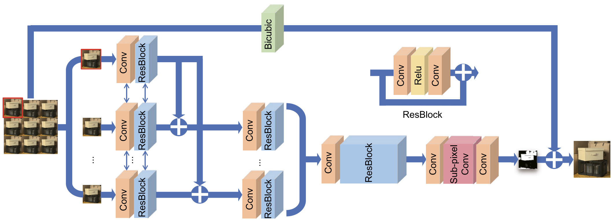

<aside>

**Three methods of Light Field Super-Resolution (LFSR):**

1. Light field **spatial** super-resolution (LFSSR)
2. Light field **angular** super-resolution (LFASR)
3. **Light field spatial and angular super-resolution (LFSASR)**

**Experiments** for each method.

</aside>

# 1. Light field spatial super-resolution (LFSSR)

Improve **spatial resolution** of each sub-aperture image (**SAI**).

## 1.1. CNN-based method

Use convolutions to learn spatial / angular correlations and fuse high-frequency details.

- **Residual CNNs**: Learn directional features and fuse sub-pixel details (e.g., resLF).
- **Feature alignment**: Optical-flow-based alignment, deformable conv alignment.
- **4D / separable CNNs**: Use 4D conv or spatial–angular separable conv to jointly extract features.
- **View fusion models**: “All-to-One”, multi-view complementary information fusion.
- **Attention-based CNNs**: Channel/view attention, angular deformable alignment.

resLF

seperable Conv model

“All-to-One” model

view+channel attention model

## 1.2. Transformer-based method

Use attention to model long-range spatial-angular dependency.

- **Spatial–angular transformer**: Self-attention along EPI lines to capture parallax geometry.
- **Volume and cross-view transformers**: Model correlations across many viewpoints.
- **Multi-scale angular transformer**: Robust to disparity variations.

EPI attention

volume transformer and cross-view transformer

**LF-DET**

# 2. Light field angular super-resolution (LFASR)

Increase **number of viewpoints** (more SAIs) while preserving geometry.

## 2.1. Depth-dependent method

Estimate depth/disparity → warp existing views → blend new views.

- Optical-flow and superpixel-based warping
- Layered depth representations
- EPI-based geometry modeling
- Depth-guided warping with occlusion reasoning

## 2.2. Depth-independent method

Avoid explicit depth; rely on signal priors or learning-based angular patterns.

- CNN-based angular detail restoration (on EPIs)
- Angular attention models to reconstruct views

# 3. Light field spatial-angular super-resolution (LFSASR)

**Simultaneously** increase both spatial and angular resolution → full 4D reconstruction.

## 3.1. Deep learning-based method

Jointly model 4D light field structure (geometry + appearance).

- **4D CNN encoder–decoder**
- **Pseudo-4D convolution** combining EPI + spatial-angular blocks
- **Disentangled models**: separate spatial and angular subspaces
- **EPI-based networks (CNN + LSTM)** preserving geometry
- **Self-supervised or domain-generalized models** for wild light fields

3D encoder

**EPI-based networks**

# Experiments

---

<aside>

### **LFSSR**

- **CNN-based**: Convolutions, 4D/sep-conv, optical-flow alignment, attention fusion.
- **Transformer-based**: Global spatial–angular modeling, EPI attention, multi-scale.

### **LFASR**

- **Depth-dependent**: Estimate depth → warp → blend new views.
- **Depth-independent**: Fourier/shearlet priors, CNN restoration on EPI, angular attention.

### **LFSASR**

- **Deep learning-based**: 4D CNNs, disentangled spatial–angular modeling, EPI networks, high-order residual networks.
</aside>
