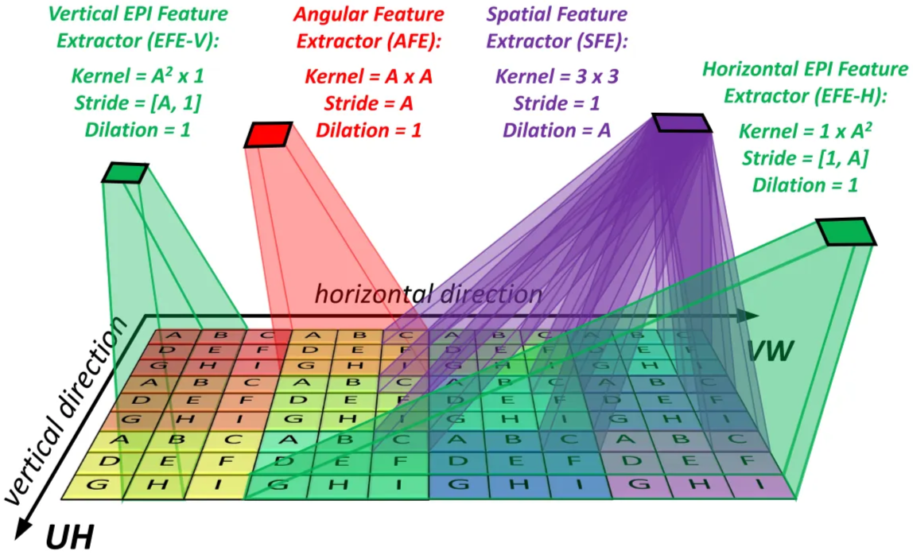
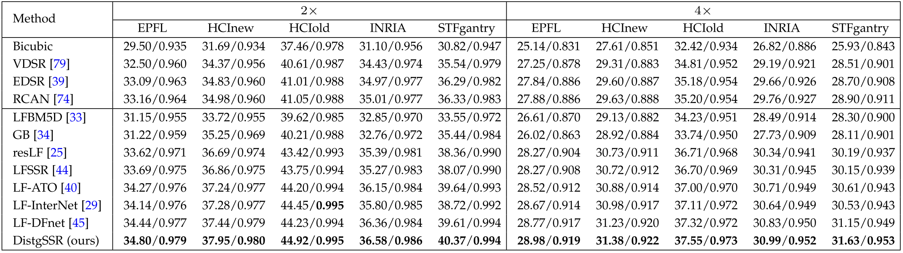

# Introduction

CNNs treat inputs as **general images** with no special structure. But LF is **not a random stack of images.** 

To be more specific, CNN expects the disparity of all pixels are the same. But in light field, objects with different depth exist in the same images! So a standard CNN kernel cannot learn mixed spatial + angular + disparity correlations incorrectly. This is **why 2D CNNs fail** on LF directly. In short, A fixed convolution window cannot follow disparity.

There are many existing methods aiming to solve this problem.

## Current Questions

The current CNN structures for LF image processing:

1. **Neighbor-view combination** → Since only 2 or 4 adjacent views were used to SR a specific view, this method cannot achieve a high reconstruction quality due to the discard of rich **angular information**.
2. **Convolution on EPIs →** since an EPI is a 2D slice of a 4D LF, performing conv on EPIs can only incorporate angular information from the same horizontal or vertical views and cannot incorporate the **spatial context prior**.
3. **Multi-stream structure →** it discards the views outside the four angular directions, resulting in under-exploitation of the rich **angular information** in an LF.
4. **Spatial-angular alternate convolution →** it processes spatial and angular features separately. The model never learns deep joint spatial-angular representations.

The key difference between existing schemes and disentangling mechanism is, disentangling mechanism can **fully use the information from all angular views** and incorporate the LF structure prior.

With this mechanism, high-dimensional LF data can be disentangled into different low-dimensional subspaces. Consequently, the difficulty for learning deep CNNs is reduced and several LF image processing tasks can be benefited.

<aside>

Take the 4D LF and separate into:

1. Spatial component (x,y)
2. Angular component (u,v)
3. Disparity component (slopes in EPI)

---

**LF structural priors** = the known geometric and angular relationships that exist naturally in light-field images.

---

Now the CNN can learn:

- Disparity changes → from angular subspace
- Texture & edges → from spatial subspace
- Parallax = correlation between spatial & angular subspaces
- LF 4D consistency = combining both subspaces
</aside>

# Method

## LF Representation

- **SAIs**: many 2D views arranged by angle.
- **3D stack**: SAIs stacked to show angular variation.
- **EPI**: a 2D slice that reveals disparity as straight lines.
- **SAI array**: full grid of all SAIs.
- **MacPI**: one 2D image where each spatial location stores angular samples.

Compared to SAI and EPI, the authors adopt the **MacPI** representation because it evenly mixes the spatial and angular information in the light field. This makes it easier to extract and combine spatial and angular features using convolution operations.

## LF Feature Disentanglement

The 4D light field contains spatial (H, W) and angular (U, V) information. To make learning easier, the model uses **three feature extractors**, each handling one 2D subspace.

- Angular feature extractor,
- Spatial feature extractor,
- Vertical EPI feature extractor,
- Horizontal EPI feature extractor.

### Spatial Feature Extractor

SFE extracts **spatial texture** inside the same view. It uses a 3×3 **dilated** convolution to avoid mixing different views. Output size stays the same as the input.

### Angular Feature Extractor

AFE extracts **angular information** inside each macro-pixel. It uses an A×A convolution with stride A, so each angular block becomes one spatial pixel. Output size becomes **H × W**.

### EPI Feature Extractors

SFE and AFE miss the **spatial–angular relationship**. EPIs show this relationship as line patterns.

- EFE-H processes **horizontal EPIs (V–W)**.
- EFE-V processes **vertical EPIs (U–H)**.

They learn **disparity and spatial–angular correlation**.

### How it solve current questions

This design keeps all **angular views**, instead of discarding neighbors or directions, so the network can fully use the complete angular information. 

It also processes spatial, angular, and EPI cues **simultaneously**, rather than alternating between them, which preserves both spatial context and angular geometry. 

The network becomes easier to train and can learn deeper, more expressive LF representations, leading to better reconstruction quality for all LF image processing tasks. 

## DistgSSR

Disentangling Mechanism for Spatial SR.

DistgSSR applies the **disentangling mechanism** to do LF spatial SR.

It converts LR SAIs to MacPI, extracts spatial, angular, and EPI features, and uses a **residual-in-residual** structure for better SR quality. Only the **Y channel** is SR; Cb/Cr are bicubic-upscaled.

<aside>

The 3 channels for image with **YCbCr color space ~~RGB~~**:

- **Y = brightness**
- **Cb = blue color difference**
- **Cr = red color difference**

Most of the **detail, texture, and edges** are stored in the **Y channel**.

Color (Cb, Cr) changes slowly and contains **low-frequency** information.

</aside>

### Distg-Block

Each Distg-Block has **four parallel branches**:

- **Spatial branch:** two SFEs to keep spatial details.
- **Angular branch:** AFE + 1×1 conv + **2D pixel shuffle** for angular-to-spatial upsampling.
- **Two EPI branches:** EFE-H/EFE-V + 1×1 conv + **1D pixel shuffle** to handle disparity through EPI lines.

All branches are fused by **1×1 conv + SFE**, with a skip connection for local residual learning.

<aside>

**PixSF-1D:**

For **EFE-H**, the **angular variation is only 1D** (the **V** direction) along a **horizontal EPI (V–W)**. Convolution flattens these V angular samples into the **horizontal (W) direction**, compressing the angular information into the **channel** space in a 1D form.

**PixSF-1D** then:

- **un-flattens** this 1D angular information.
- rearranges it **back into the correct spatial structure.**
- but **only along one direction** (horizontal).

**So PixSF-1D re-expands 1D angular EPIs into spatial feature maps along a single axis.**

</aside>

### Spatial Upsampling

After all groups, MacPI features are reshaped back to SAIs.

A 1×1 conv increases channels, a **PixSF-2D** upsamples the resolution, and a final 1×1 conv to reduce channels to 1, so the output is the HR **Y-SAIs**.

**Cb** and **Cr** from the input are bicubic-upsampled to the same HR size, channels (Y, Cb, Cr) are combined and convert to RGB version. That gives the final HR LF image.

### Experiments

Achieve **high spatial reconstruction quality** and **angular consistency.**

## DistgASR

Disentangling Mechanism for Angular SR.

DistgASR applies the disentangling mechanism to **angular super-resolution**.

It takes a **sparse angular SAI array** and reconstructs a **dense angular array**. The input SAI array is first converted to a **MacPI** for spatial, angular, and EPI feature extraction.

### Distg-Block for ASR

A Distg-Block separately processes **spatial**, **angular**, and **EPI** features. Then the features are fused.

For ASR, angular information is more important because we must create many new views. Also, disparity between sparse views is large, so EPI features are helpful.

Therefore, the angular and EPI branches output **C channels** to keep more useful information.

### Angular Upsampling

Angular upsampling must handle **non-integer upsampling factors** (for example 2×2 → 7×7).

Pixel shuffle cannot handle non-integer factors directly.

So the network uses a **downsample–upsample strategy**. 

Steps→

1. AFE produces a **downsampled angular feature**.
2. A **1×1 conv** expands channels.
3. A **2D pixel shuffle** performs angular upsampling.
4. Finally, a **1×1 conv + SFE** recover the output SAI array.

This allows clean and flexible angular SR, even when the upsampling factor is non-integer.

## DistgDISP

Disentangling Mechanism For Disparity Estimation.

DistgDisp applies the disentangling mechanism to **light-field disparity estimation**.

The network input is a **MacPI** with 9×9 angular views. The network performs:

**feature extraction → cost volume construction → cost aggregation → disparity regression.**

### Spatial Res-Block forFeature Extraction

A **Spatial Res-Block** is used to extract **spatial features**. It uses **SFE + BN + LeakyReLU + SFE + BN**. A residual skip adds the input back to the block output. This helps model spatial context and smooth texture areas.

### DS-AFEs for CostVolume Construction

Cost volume needs features from **different disparities**. Existing LF methods use “shift-and-concat”, which is slow. DistgDisp replaces this with **DS-AFEs**, which directly convolve pixels that match a specific disparity.

DS-AFE works like this:

- For each view (u, v), the offset of its corresponding pixel depends on **disparity d**.
- When converted into MacPI, pixels of the same disparity form a **square pattern**.
- A properly designed convolution (padding) can extract all pixels with disparity **d** in one pass.

Different disparity values use different **dilation and padding**.

The author use 9 disparity levels (−4 to +4). For each disparity, a **cost volume** is produced. All cost volumes are concatenated into a 5D tensor **B × 9 × C × H × W**.

### Cost Aggregation and Disparity Regression

Eight **3D convolutions** (3×3×3 kernel) aggregate the cost volumes. This produces a final 3D tensor of size **D × H × W**. A softmax is applied along the disparity axis.

The predicted disparity is:

$$
\hat{d} = \sum_{d \in D} d \cdot softmax(F_{final})
$$

This gives the final disparity map.