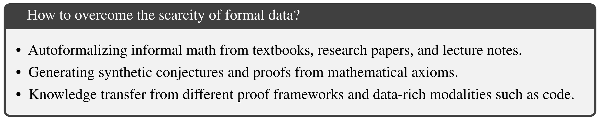
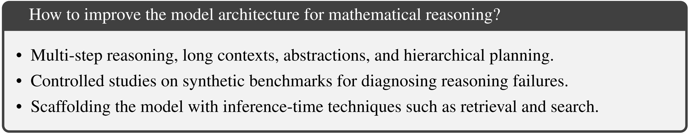
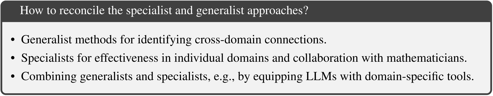
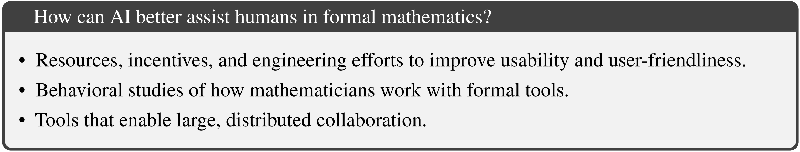

# 1. Introduction

### **1.1. Informal math LLMs have improved, but face clear limits**

Most current AI4Math models use NLP-style “informal reasoning” (datasets, CoT, self-consistency).

They perform well on benchmarks like GSM8K and MATH, but this approach struggles to scale to **advanced or research-level mathematics** due to:

- scarcity of high-quality data
- difficulty evaluating long reasoning chains
- hallucinated or invalid reasoning

### **1.2. Scaling training alone is not enough**

Simply making models bigger and training on more data cannot solve these limitations.

Recently, systems like **OpenAI o1** try to scale inference-time reasoning (search + verification), but their effectiveness on advanced math remains uncertain.

<aside>

**Inference-time reasoning** is the process where a model performs extended, multi-step thinking during answer generation / inference, often involving search(generate several answers → select one), self-correction, and verification—without retraining the model.

</aside>

### **1.3. Formal mathematical reasoning is a crucial complementary path**

Formal methods use **proof assistants** (Lean, Coq, Isabelle) that:

- enforce strict, verifiable logic
- provide reliable feedback
- reduce hallucination
- support synthetic data generation

### **1.4. Recent successes show the promise of formal methods**

Neuro-symbolic systems like **AlphaProof** and **AlphaGeometry** achieve breakthrough results by combining:

- symbolic formal systems (**proof assiatant**)→ **PA**
- neural reasoning models

These demonstrate that formal reasoning can scale to high-level mathematics.

### **1.5. The field is at an inflection point**

AI-based formal mathematical reasoning is rapidly growing and has major potential for:

- advancing pure mathematics
- improving software/hardware verification
- building reliable reasoning systems

The paper argues that **formal reasoning should complement informal LLM approaches** to push AI4Math forward.

# 2. Method

## 2.1. Informal Reasoning LLM

NuminaMath: a math LLM for informal reasoning:

1. Math pretraining
2. Finetuning on step-by-step solutions
3. Tool-integrated reasoning

## 2.2. Formal Mathematical Reasoning

### 2.2.1. Formal Proof Assistant

Think of **Lean** like a strict programming language for math:

- **Proof Tree** = how a single theorem is proved internally by Lean
    - nodes are **goals**, edges are **tactics**
- **Lean File** = the code written by humans to prove the theorem
- **Project** = a whole project full of code

### 2.2.2. Neuro-symbolic Theorem Prover

---

# 3. Open Challenges and Future Directions

## 3.1. Data

## 3.2. Algorithms

## 3.3. Tools for Assisting Human Mathematicians

# 4. Milestones and Success Measures

---

---

---

---

