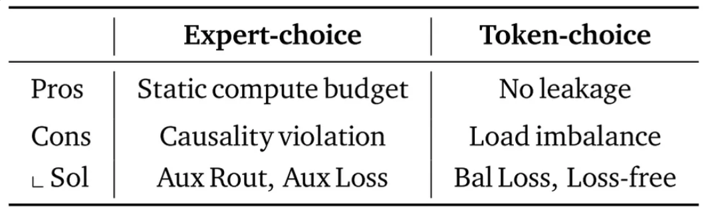

# Introduction

Large Transformer models achieve strong generalization and reasoning ability, but their huge size requires massive memory and computation. This makes them hard to train and deploy outside large data centers. To address this, researchers look for **efficient architectures** that save parameters or computation. Two main directions are **parameter efficiency**, which reduces or shares model weights, and **adaptive computation**, which uses more compute only when necessary.

A common way to improve parameter efficiency is **layer tying**, where the same set of weights is reused across multiple layers. For adaptive computation, methods like **early exiting** let the model stop processing simple tokens earlier. However, most existing models treat these two goals separately. A unified design that combines both efficiency types has been missing. **Recursive Transformers** reuse **one set of layers** multiple times, naturally achieving weight sharing. Yet, previous recursive models often fix the number of recursions for all tokens. This wastes computation because every token receives the same processing depth, regardless of difficulty. Attempts at dynamic recursion have also faced training and efficiency challenges.

To solve these issues, the **Mixture-of-Recursions (MoR)** framework was proposed. It introduces a **router** that learns how many recursive steps each token needs. Easy tokens stop early, while complex ones go through more recursions. This provides true **token-level adaptive depth**. MoR also includes **key–value (KV) caching**, storing results from previous recursions to reduce memory use and improve throughput.

<aside>

One Transformer layer = **Self-Attention + Feed-Forward + Normalization + Residual connections**.

</aside>

Conceptually, MoR provides a model to “think” recursively inside its latent space during decoding of each token. It adjusts its reasoning depth per token instead of using a fixed number of layers. In this way, MoR unifies **parameter efficiency** and **adaptive computation** in one efficient Transformer architecture.

Through this design, MoR achieves three goals at once:

1. **Weight sharing** reduces model parameters.
2. **Dynamic routing** saves computation by skipping redundant steps.
3. **KV caching** lowers memory traffic and speeds up inference.

# Methods

**Mixture-of-Recursions (MoR)**—a framework that dynamically adjusts recursion step for each token during pretraining and inference. 

The core of MoR lies in two components: 

1. **a routing mechanism** that assigns token-specific recursion steps to adaptively concentrate computation on more challenging tokens;
2. **a KV caching strategy** that defines how KV pairs are stored and selectively utilized for attention at each recursive step.

## 1. Routing Stategies: Expert-choice vs. Token-choice

### **Expert-choice routing**

<aside>

each recursion —select→ top-k tokens

</aside>

In **expert-choice routing**, each recursion depth is treated as an **expert**. At every recursion step $r$, only the top-k tokens (with the highest scores) are selected to pass through that expert’s recursion block.

The router computes a scalar **routing score** for each token:

$$
g_t^r = G(\theta_r^\top H_t^r)
$$

where $\mathcal{G}$ is an activation function (e.g., sigmoid or tanh).

Then, tokens with scores above the $\beta$-percentile threshold $P_\beta(G^r)$ are selected to proceed:

$$
H_t^{r+1} =
\begin{cases}
g_t^r f(H_t^r, \Phi') + Ht^r, & \text{if } g_t^r > P_\beta(G^r) \\\\
H_t^r, & otherwise
\end{cases}
$$

- $r$: recursion steps
- $t$: token

This selective routing makes each recursion act like a different “expert,” and tokens move deeper only when needed. A mechanism called **hierarchical filtering** ensures that tokens selected at one step can still be re-evaluated at later steps, supporting early-exit-like behavior while training from scratch.

### **Token-choice routing**

<aside>

each token —select→ recursion depth

</aside>

In **token-choice routing**, each token independently chooses **which recursion expert** it wants to follow for all subsequent steps. Unlike expert-choice, routing happens **once per token**, not at every recursion step.

Given the hidden state $\mathcal{H}_t^1$ at the first layer, the router computes **routing scores** for all experts $N$:

$$
g_t^j = \mathcal{G}(\theta_r^\top \mathcal{H}_t^1), \quad j \in {1, \dots, N_r}
$$

Each token selects its **expert $i$** with the highest score ($i$ = the recursion depth of the token go through):

$$
i = \arg\max_j g_t^j
$$

and applies that recursion block $i$ times.

The hidden state is updated recursively as:

$$
H_t^{r+1} =
\begin{cases}
g_t^r f(H_t^r, \Phi') + H_t^1, & \text{if } r = i, last~recursion \\\\
g_t^r f(H_t^r, \Phi'), & otherwise
\end{cases}
$$

This approach avoids information leakage and makes each token commit to a fixed recursion path, though it may cause **load imbalance** among experts.

<aside>

**For Expert-choice:**

**Hierarchical filtering** keeps recursion steps causally ordered in data flow — each step selects tokens only from the previous one. 

However, during parallelized training, all recursion steps are computed at once, so gradients from deeper steps can flow backward and influence earlier routers. 

This introduces **training-time causality violation** — even though the hierarchical filtering itself maintains structural causality.

</aside>

## 2. KV Caching Strategies: Recursion-wise Caching vs. Recursive sharing

Dynamic-depth models face challenges with **KV cache consistency** during autoregressive decoding. When a token exits early, its keys and values from deeper recursion steps are missing, which causes incomplete context for later tokens. Previous methods tried to reuse or recompute these entries but introduced extra complexity. To address this, MoR proposes two efficient strategies: **recursion-wise KV caching** and **recursive KV sharing**.

In **recursion-wise KV caching**, only the tokens selected for a specific recursion step store their key–value pairs at that level. The cache size at each depth depends on how many tokens are routed there. Attention computation is restricted to these locally cached tokens. This makes computation more localized, saving memory and reducing input/output operations.

In **recursive KV sharing**, all tokens share the KV pairs produced at the first recursion block. These cached pairs are reused by all later recursion steps, so each step still has access to the full sequence context. Even though fewer tokens may continue deeper, their keys and values still represent the whole sequence, preventing missing-context problems.

**Recursion-wise caching** reduces KV memory and IO usage roughly by a factor of $(N_r+1)/(2N_r)$ across the model and decreases attention FLOPs, making both training and inference more efficient. **Recursive sharing** saves even more memory by globally reusing context, though it provides less FLOP reduction and still faces IO bottlenecks during decoding. Overall, both strategies improve efficiency but trade off between **local memory savings** (recursion-wise) and **global context reuse** (recursive sharing).

# More Details

Parameter-sharing strategies in Recursive Transformers.

So an equation such as

$$
f(h_t^{\ell}; \Phi'_{\ell \bmod (L/N_r)})
$$

means:

- take the token representation $h_t^{\ell}$,
- apply a layer function $f(\cdot)$ using parameters $\Phi'$,
- and reuse weights cyclically according to the current recursion index $\ell$.

# Results

- MoR outperforms baselines with fewer parameters under equal train compute.
- MoR outperforms baselines with less compute at equal data.
- MoR performance varies with routing and caching strategies.

# Conclusion

**Mixture-of-Recursions (MoR)** is a Transformer model that combines **parameter sharing**, **adaptive recursion depth**, and **efficient KV caching**. It uses routers to decide how many recursive steps each token needs and stores KV pairs only for active tokens. This design cuts unnecessary computation and memory use while keeping strong performance. Experiments show that MoR achieves lower perplexity, higher few-shot accuracy, and faster inference than standard Transformers or earlier recursive models.

## **Future Work**

Future work will focus on improving reasoning ability. Since MoR already adapts depth per token, it can be trained to adjust recursion depth based on reasoning difficulty, helping the model handle chain-of-thought tasks better.

MoR can also be scaled to larger models. Future versions will train models with over 3B parameters and may use depth-specific LoRA, expert modules, or expert parallelism to improve performance without slowing inference. Reusing pre-trained LLMs could further reduce training cost.

Another goal is to make MoR more flexible during inference. The current router outputs are too sharp, making it hard to change capacity or top-k values after training. New routing methods are needed for dynamic control.

MoR can also benefit from sparsity methods like pruning and quantization to skip unnecessary computation, improving efficiency further.

Finally, MoR’s adaptive recursion is not limited to text. It can be extended to vision, speech, and multimodal models. Adjusting depth for different tokens or segments could make processing long videos or audio more efficient in both memory and speed.