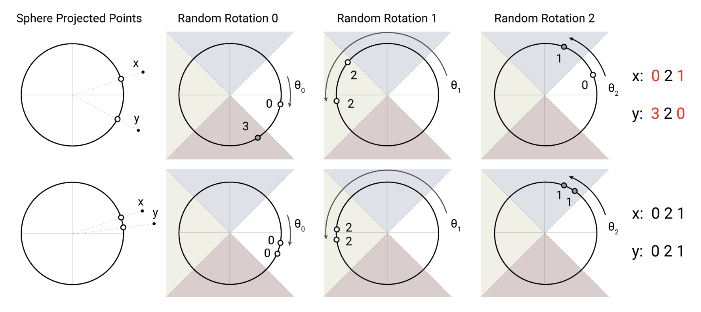

# 1. Problem

Transformer models achieve strong performance but are **extremely inefficient for long sequences and deep architectures**. In practice, they suffer from three fundamental bottlenecks:

1. **Activation memory scales linearly with the number of layers**, because activations must be stored for backpropagation;
2. **Feed-forward layers consume large memory**, since the intermediate dimension $d_{ff}$ is much larger than the model dimension;
3. **Self-attention has quadratic time and memory complexity $O(L^2)$** in sequence length, making long sequences (e.g., 64K tokens) impractical even with memory-efficient implementations.

As a result, large Transformers often **cannot be trained or even fine-tuned on a single accelerator**, limiting scalability and accessibility. The key question posed by the paper is whether this limitation is fundamental—or merely due to architectural inefficiency.

# 2. Method

Reformer addresses these inefficiencies by redesigning the Transformer with three complementary techniques:

## **2.1. Locality-Sensitive Hashing (LSH) Attention**

Full dot-product attention is replaced with an approximate attention mechanism based on angular locality-sensitive hashing. Queries and keys are shared $(Q=K)$ and hashed so that only **nearby tokens (in embedding space)** attend to each other. This reduces attention complexity from $O(L^2)$ to **$O(L \log L)$** while preserving accuracy through multiple hashing rounds.

## **2.2. Reversible Residual Layers**

Standard residual connections are replaced with **reversible layers**, allowing activations from earlier layers to be reconstructed during backpropagation instead of stored. This removes the **linear dependence on the number of layers** in activation memory.

## **2.3. Chunked Feed-Forward Computation**

Feed-forward layers are computed in **chunks over the sequence dimension**, exploiting position-wise independence. This avoids storing large intermediate activations of size $d_{ff}$, further reducing peak memory usage.

# Takeaway

Together, these changes produce the **Reformer architecture**, which matches standard Transformer performance while enabling efficient training on **very long sequences and deep models** with dramatically lower memory requirements.