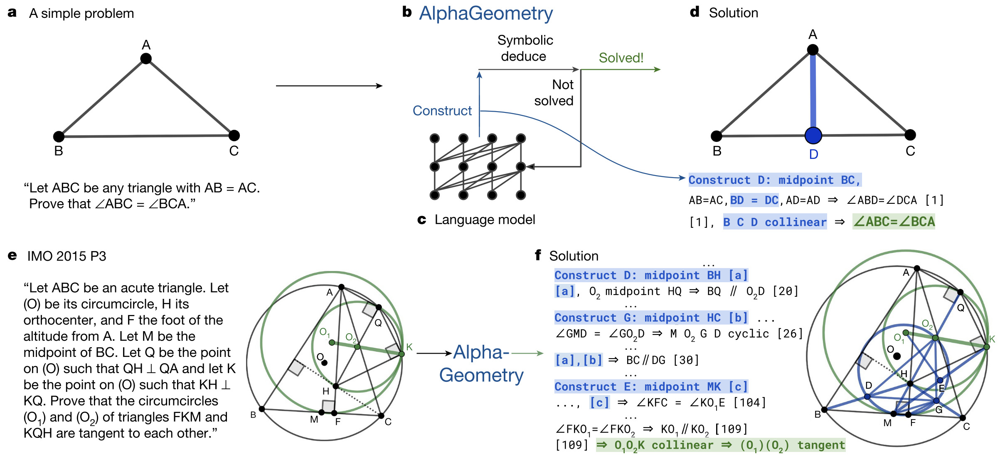

# Introduction

**Theorem proving is hard for ML** because there are not enough human-written proofs in formal languages. **Geometry is especially difficult** because translating human geometric proofs into machine-verifiable form is very hard.

Current geometry provers rely mainly on **symbolic rules and hand-crafted heuristics**, not learning. The authors solve the data shortage by generating **100 million synthetic theorems and proofs** using symbolic engines.

They introduce **dependency difference**, which helps create nearly **10 million steps of auxiliary constructions**. **Auxiliary construction** means adding new helper points; this creates infinite branching and is the hardest part of geometry proofs. The synthetic data lets the model **learn auxiliary constructions without human demonstrations**.

They train a **language model** on all synthetic proofs and fine-tune it to focus on auxiliary constructions. The symbolic engines handle all normal deduction steps, while the neural model generates new proof terms.

The resulting system, **AlphaGeometry**, proves geometry problems and produces **human-readable proofs**, performing close to an IMO gold medalist level.

# Method

## **Generate synthetic geometry data**

1. Random simple premises → **symbolic engine** → 100M synthetic theorems + proofs.
2. Symbolic Engine is built manually: 
    1. Deductive Database (**DD**) → Databse of deductive rules (symbolic rules)
    2. Algebraic Reasoning (**AR**) → Gaussian method (algebraic solver)

## **Extract auxiliary constructions**:

1. Use **dependency difference** to find extra helper points (~10M).

<aside>

**Dependency difference works like this:**

1. Generate random geometry premises.
2. Use symbolic engine to derive all proofs.
3. For each conclusion, use traceback to find the minimal premises needed.
4. Compare minimal premises vs. original premises.
5. The difference gives extra points — interpreted as **auxiliary constructions**.
6. These extra points become training examples for the language model.

This teaches the model to generate helper points **fully automatically**, without human supervision.

</aside>

Compare the conclusion with its minimal required premises. Any extra points used along the way are treated as **auxiliary constructions** (~10M examples). These teach the model how to add helpful new points.

## **Train a Transformer model** on serialized proofs.

1. Feed it the serialized form of each synthetic theorem:
    
    **<premises> <conclusion> <proof>**.
    
2. The model learns how proofs and helper constructions look.

## **Neuro-symbolic proof search**:

1. The symbolic engine tries to prove the input problem using known rules.
2. If it cannot finish, the language model proposes a **new helper point**.
3. Add the point → try symbolic engine again → repeat until solved.

<aside>

Think of AlphaGeometry as a **student solving a geometry problem**:

**Step 1: Try to solve it with what you already know**

This is the **Symbolic Engine**.

**Step 2: If you're stuck, add a new helper point**

This is the **Language Model**.

Then repeat. This cycle continues until the solution appears.

</aside>

# Novelty

1. **Generate all training data synthetically**
    
    → No human proofs needed.
    
2. **Introduce “dependency difference”**
    
    → Automatically learn auxiliary constructions (helper points).
    
3. **Neuro-symbolic loop**
    1. Symbolic engine deduces
    2. Neural model adds new constructions when stuck.

These three ideas together let AlphaGeometry reach **near IMO gold-medalist level** in geometry.

<aside>

- **Neural = intuition and exploration.**
    - Uses a neural network to propose new ideas when rules are not enough.
- **Symbolic = logic and verification.**
    - Uses exact deduction rules to prune the search and ensure correctness.

**Neuro-symbolic = combine neural creativity + symbolic rigor
to solve problems that require both exploration and precise reasoning.**

</aside>