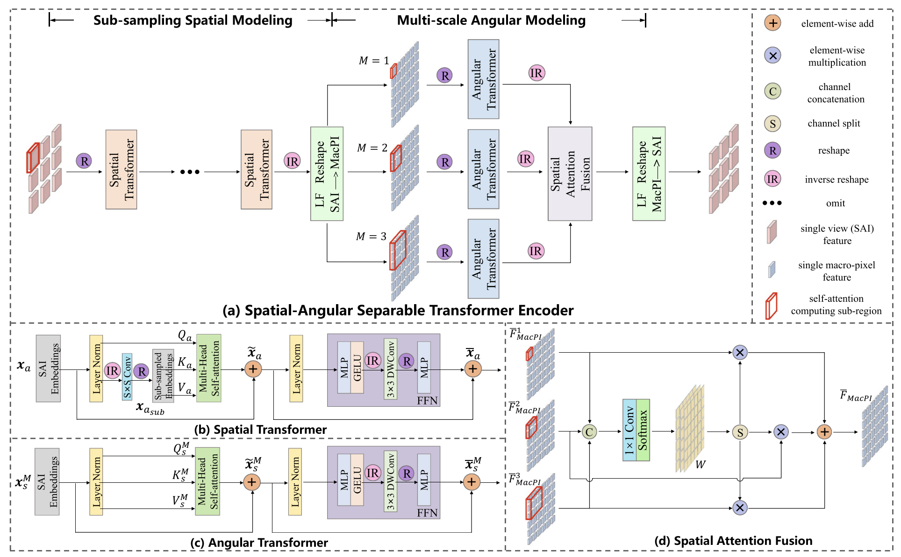

# Introduction

An LF records both **intensity information** and **directional information of all light rays**. The currently popular representation for **four-dimensional(4D)** LF is the two-plane parametrization.

Since the resolution of the device sensor is fixed, there is a trade-off between spatial and angular resolution. As a result, **LF spatial super-resolution (LF-SSR)** which aims to reconstruct high-resolution (HR) LF from its LR counterpart has attracted lots of attention.

To achieve high-quality LF-SSR performance, the key is to make full use of **angular information** which is not available in SISR.

For the CNNs, the local nature of convolutional filters raises a fundamental limitation in accessing **global dependency**. For the transformer, it provides global context modeling by self-attention mechanism, but the global interaction comes at a quadratic computational complexity cost. In addition, vision transformers are widely used to process 2D images rather than the complex 4D LFs. More efforts are needed to exploit an effective way to implement fully attentive features by transformers.

The paper proposes a new transformer-based network called **LF-DET** for light field spatial super-resolution. It first extracts local information from each sub-aperture image using convolution layers, then applies a **spatial–angular separable transformer** to model global context along both spatial and angular dimensions. The **sub-sampling spatial modeling** reduces computation cost, while the **multi-scale angular modeling** handles different disparity ranges effectively. Finally, hierarchical features from multiple transformer encoders are fused for high-quality reconstruction. LF-DET provides a flexible balance between model size, accuracy, and efficiency, and experiments show it achieves superior performance over existing methods.

# Method

## Spatial–Angular Separable Transformer Encoder

A standard transformer handles 1D token sequences, but a light field (LF) image is 4D $H \times W \times U \times V$. Flattening it into 1D causes high computational and memory costs. The **vanilla transformer** cannot efficiently process such large data. To solve this, a **spatial–angular separable transformer encoder** is designed. It includes two main parts: **sub-sampling spatial modeling** and **multi-scale angular modeling**.

### A. Sub-Sampling Spatial Modeling

High-resolution SAIs lead to heavy computation and memory use. To handle this, a **sub-sampling convolution** is used before the multi-head self-attention (MSA) to reduce token number.

Given LF features $F_a \in R^{C \times H \times W}$, we reshape them to embeddings $x_a \in R^{(HW) \times C}$.

The queries, keys, and values are calculated as:

$$
Q_a = x_a W_Q, \quad K_a = x_{a_{sub}} W_K, \quad V_a = x_{a_{sub}} W_V
$$

where $W_Q, W_K, W_V \in R^{C \times C}$.

The self-attention for the (p)-th subspace is:

$$
SA_p(Q_{a,p}, K_{a,p}, V_{a,p}) = softmax \left( \frac{Q_{a,p}(K_{a,p})^T}{\sqrt{C/P}} \right)V_{a,p}
$$

After concatenating all subspaces, the result is:

$$
\tilde{x}_a = [SA_1, SA_2, \ldots, SA_P]W_P + x_a
$$

where $W_P \in R^{C \times C}$. This sub-sampling strategy reduces computation by a ratio of $S^2$.

Since attention ignores token order, a 3×3 convolution is added in FFN to insert positional encoding and local information:

$$
x_a = MLP(GELU(DWConv(MLP(\tilde{x}_a)))) + \tilde{x}_a
$$

where **DWConv** is depth-wise convolution and **GELU** is the activation. This introduces spatial locality to the transformer.

Finally, $x_a \in R^{(HW) \times C}$ represents the spatial transformer output, and $K$ such transformers are cascaded to enhance global spatial features.

### B. Multi-Scale Angular Modeling

To model angular information, **angular transformers** process macro-pixels. Since objects with different disparities are misaligned across views, the network analyzes different macro-pixel scales.

For a downsampling factor $\alpha$, the valid disparity range in a region of $M \times M$ macro-pixels is $[-\alpha M, \alpha M]$. Larger $M$ captures larger disparities but increases cost and mismatch, so three scales (M=1,2,3) are used. Each $M \times M$ macro-pixel group is reshaped into sequences $x_s^M \in R^{(M^2UV) \times C}$.

The attention mechanism is similar to the spatial transformer:

$$
Q_s^M = x_s^M W_Q, \quad K_s^M = x_s^M W_K, \quad V_s^M = x_s^M W_V
$$

$$
SA_p(Q_{s,p}^M, K_{s,p}^M, V_{s,p}^M) = softmax \left( \frac{Q_{s,p}^M (K_{s,p}^M)^T}{\sqrt{C/P}} \right)V_{s,p}^M
$$

$$
\tilde{x}_s^M = [SA_1, SA_2, \ldots, SA_P]W_P + x_s^M
$$

After FFN with DWConv, the final angular feature is:

$$
x_s^M = MLP(GELU(DWConv(MLP(\tilde{x}_s^M)))) + \tilde{x}s^M
$$

Each scale outputs a feature map $F_{MacPI}^M \in R^{C \times H_U \times W_V}$ focusing on a specific disparity range.

### C. Spatial Attention Fusion

The three angular feature maps are concatenated and passed through a 1×1 convolution and softmax to compute attention weights:

$$
W = softmax(H_{1\times1}[F_{MacPI}^1, F_{MacPI}^2, F_{MacPI}^3])
$$

The weights are split and applied to each feature map, producing the fused output:

$$
\overline{F}_{MacPI} = \sum_{M=1}^3 W^M F_{MacPI}^M
$$

This adaptive fusion enables the model to handle both small and large disparity regions effectively.

---

## Network Architecture

LF-DET is a transformer-based network for light field super-resolution. The input light field $L^{LR} \in R^{U \times V \times H \times W}$ is converted from RGB to YCbCr, and only the Y channel is used. The goal is to reconstruct a high-resolution output $L^{HR} \in R^{U \times V \times \alpha H \times \alpha W}$, where $\alpha$ is the upsampling factor. The Cb and Cr channels are upsampled by bicubic interpolation.

The network has an **encoder–decoder** structure. The encoder extracts local and global features, and the decoder fuses them through a **Hierarchical Feature Aggregation (HFA)** module. The final upsampling block generates the high-resolution light field.

### A. Local Feature Extraction

Local context is important for super-resolution. The vanilla transformer cannot model local dependencies well. To fix this, LF-DET uses several **3×3 convolution layers** with Leaky ReLU activations.

Each SAI is processed by one convolution and three stacked convolutions, followed by a residual connection. This produces the initial local features $F_a^0 \in R^{C \times H \times W}$. The same convolution weights are shared across all views.

### B. Global Feature Extraction

Global spatial and angular information is modeled using **spatial–angular separable transformer encoders**. Each encoder first performs sub-sampling spatial modeling, then reshapes the data to the MacPI pattern for angular modeling.

The process for the (n)-th encoder is:

$$
F_a^n = R_{LF_2}(H_{MAM}^n(R_{LF_1}(H_{SSM}^n(F_a^{n-1}))))
$$

These encoders are stacked sequentially to extract deep and global correlations across views.

### C. Hierarchical Feature Aggregation & Upsampling

The **HFA module** merges features from all encoder layers. Shallow and deep features are fused by element-wise addition and refined by three **3×3 convolution layers**.

The overall fusion is:

$$
\overline{F_a} = [H_{FE}^1 \sum_{i=1}^N F_a^i, H_{FE}^2 \sum_{i=2}^N F_a^i, \ldots, H_{FE}^N \sum_{i=N}^N F_a^i]
$$

Then, the fused feature $\overline{F}_a$ goes through an upsampling block with two convolutions, a pixel-shuffle layer, and Leaky ReLU activation. The pixel-shuffle enlarges the resolution from $H \times W$ to $\alpha H \times \alpha W$, and the final **3×3 convolution** produces the output Y-channel image.