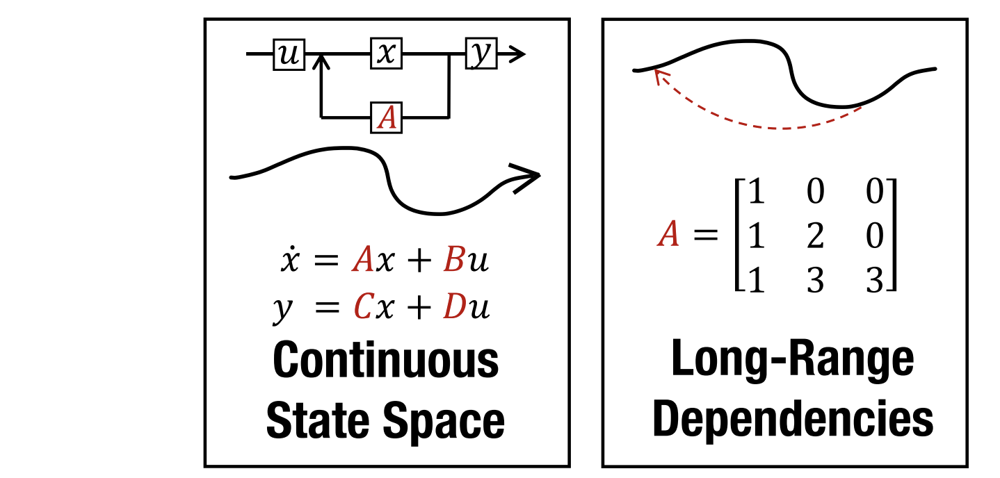

# Introduction

Most models (RNNs, CNNs, Transformers) cannot handle **very long sequences** well. They either forget, see too little context, or are too slow. This makes long-range dependency tasks hard to solve.

**State Space Models (SSMs)** can solve this issue by remembering long information. But the old version (LSSL) used too much **time and memory**, so it was not practical.

New solution **S4** fixes this by changing how the SSM is built. It splits the main matrix into simple parts and computes in a faster, more stable way. Now it runs **much faster** and uses **much less memory**.

# Background: State Spaces

**State Space Models (SSMs)** describe how input changes hidden states and produces output. They learn parameters **A, B, C, D** automatically. Usually, **D** is ignored because it’s just a shortcut.

$$
x'(t) = A x(t) + B u(t) \\\\
y(t) = C x(t) + D u(t)
$$

The **basic SSM** forgets or explodes on long sequences. **HiPPO** fixes this by giving a special matrix for A that helps the model remember long-term information.

<aside>

We mainly focus on **optimizing A** because A is the **bottleneck** — it controls how the model remembers information over time. B and C are much simpler — they only handle input and output scaling.

</aside>

$$
A_{nk} =
\begin{cases}
-(2n + 1)^{1/2}(2k + 1)^{1/2}, & \text{if } n > k \\\\
-(n + 1), & \text{if } n = k \\\\
0, & \text{if } n < k
\end{cases}
$$

Real data comes in steps, so the SSM is turned into a **discrete version** that works like an RNN. To train faster, the model is rewritten as a **convolution**, which processes all inputs **in parallel**. The convolution weights are called the **SSM kernel (K)**. (More details move to **More Details**)

# Method: Structured State Spaces (S4)

**S4** is a new way to make State Space Models (SSMs) fast and stable. The technical results focus on developing the **S4 parameterization** and showing how to efficiently compute all views of the SSM. It connects three forms of SSMs — continuous, recurrent, and convolutional — in one model.

The old method was slow because it multiplied a big matrix many times. S4 fixes this by rewriting the matrix as **Normal + Low-Rank**, which is easier to compute. This design makes S4 very efficient:

- **Recurrent form:** O(N) time per step
- **Convolution form:** O(N + L) total time

Each S4 layer has trainable parts **(Λ, P, Q, B, C)** and works like a CNN or Transformer layer. Stacking layers with **activations** makes it powerful for long-sequence data.

$$
A = V \Lambda V^{} - P Q^{\top} = V \left( \Lambda - (V^{}P)(V^{}Q)^{} \right) V^{*}
$$

# Conclusion

S4 is based on the **State Space Model (SSM)**, which works like an RNN — it keeps a hidden state and updates it over time. 

The problem with the old version is that the **state update matrix A** is hard to compute and unstable for long sequences. S4 solves this by **rewriting A** into a new, easier form:

$$
A = V \Lambda V^{*} - P Q^{\top}
$$

This form (called **Normal + Low-Rank**) makes A stable, efficient, and fast to compute. As a result, S4 keeps the good memory ability of RNNs but runs much faster and handles much longer sequences.

---

# More Details

## Step 1: The original state space equations

Continuous-time form:

$$
x'(t) = A x(t) + B u(t)
$$

$$
y(t) = C x(t)
$$

Discrete-time version (after discretization):

$$
x_k = \bar{A} x_{k-1} + \bar{B} u_k
$$

$$
y_k = \bar{C} x_k
$$

Here:

- $x_k$: memory or hidden state at step $k$
- $u_k$: input at step $k$
- $y_k$: output at step $k$
- $\bar{A}, \bar{B}, \bar{C}$: system parameters

This is a **recurrent process** — to get $x_k$, we need $x_{k-1}$. So it must be done **step-by-step**, like an RNN → **no parallelization**.

## Step 2: Expand the recurrence

We can “unroll” the recurrence to express $x_k$ directly in terms of **all previous inputs**:

$$
x_k = \bar{A}^k x_0 + \sum_{i=0}^{k-1} \bar{A}^i \bar{B} u_{k-i}
$$

If we ignore the initial state $(x_0 = 0)$, then:

$$
x_k = \sum_{i=0}^{k-1} \bar{A}^i \bar{B} u_{k-i}
$$

Now substitute this into $y_k = \bar{C} x_k$:

$$
y_k = \bar{C} \sum_{i=0}^{k-1} \bar{A}^i \bar{B} u_{k-i}
$$

Rewriting it:

$$
y_k = \sum_{i=0}^{k-1} (\bar{C}\bar{A}^i\bar{B}) u_{k-i}
$$

## Step 3: Define the **kernel**

Let’s define a **kernel** $\bar{K}_i = \bar{C}\bar{A}^i\bar{B}$.

Then the output becomes:

$$
y_k = \sum_{i=0}^{k-1} \bar{K_i} u_{k-i}
$$

That’s exactly a **1D convolution**:

$$
y = \bar{K} * u
$$

So instead of computing step-by-step updates of $x_k$, we can compute all outputs **at once** using convolution.

## Step 4: Parallelization using FFT

<aside>

There is a mathematical truth from signal processing:

→ **A convolution in time is equal to a multiplication in frequency.**

</aside>

A convolution in time domain can be computed efficiently in **frequency domain** (via FFT):

$$
F(y) = F(\bar{K} * u) = F(\bar{K}) \odot F(u)
$$

(where $\odot$ means elementwise multiplication.)

Then invert it back:

$$
y = F^{-1}(F(\bar{K}) \odot F(u))
$$

Using FFT, this whole computation is **O(L log L)** instead of **O(L²)**, and it can be done **for all time steps in parallel** — no need to wait for $x_{k-1}$.

## Step 5: Why S4 can do this efficiently

In normal SSMs, computing each $\bar{A}^i\bar{B}$ is expensive → O(N²L). S4 makes it efficient by **reparameterizing A** as:

$$
A = V \Lambda V^{*} - P Q^{\top}
$$

which allows **fast and stable** computation of $\bar{K}$ using frequency-space math (Cauchy kernel + Woodbury identity). That’s how S4 converts a **recurrent model** into a **parallelizable convolutional model** while keeping the same meaning.