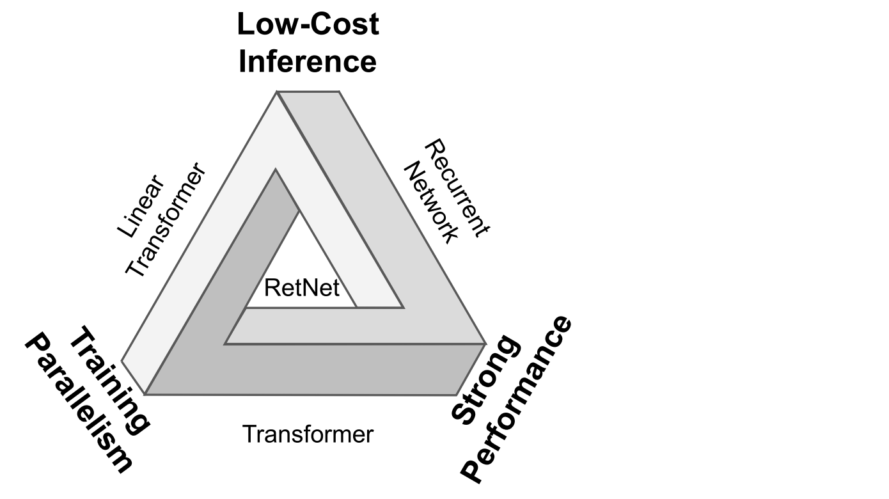

# Introduction

Transformer was introduced for its strong performance and efficient parallel training, but its inference cost remains high. This creates an “impossible triangle”, where the three dimentions can not be balanced simultaneously. **Retentive networks (RetNet)** make it possible!

# Method

For an L-layer retention network, the author stacks **multi-scale retention (MSR)** and **feed-forward network(FFN)** to build the model. 

Formally, the input sequence $x_i$ is transformed to vectors by a word embedding layer. Use the packed embeddings $X^0 = [x_1, · · · , x_{|x|}] ∈ R^{|x|×d_{model}}$ as the input and compute the model output $X^L$:

$$
Y^l = MSR(LN(X^l)) +X^l
$$

$$
X^{l+1} = FFN(LN(Y^l)) +Y^l
$$

where LN(·) is LayerNorm. The FFN part is computed as $FFN(X) = gelu(XW_1)W_2$, where W1, W2 are parameter matrices.

---

<aside>

Retention is a new way for a model to **remember previous tokens** — similar to attention, but faster. It combines **parallel** and **recurrent** forms:

- During **training**, it runs in **parallel** (like attention, efficient on GPUs).
- During **inference**, it runs **recurrently**, step by step, like an RNN.

**The core idea**: 

- Instead of learning complex attention weights with **softmax**,
- Retention uses a simple **exponential decay** to remember past information which have already combined the weighted values from past tokens.
</aside>

| Form | How it computes | Best for | Speed | Memory use | Key idea |
| --- | --- | --- | --- | --- | --- |
| **Parallel** | All tokens at once | Training | ⚡ Fast | 💾 High | Full GPU parallelism |
| **Recurrent** | One token at a time | Inference | 🐢 Slower | 🧠 Very low | Step-by-step memory |
| **Chunkwise** | In chunks (hybrid) | Long sequences | ⚖️ Balanced | ⚖️ Medium | Parallel + Recurrent combo |

## 1. Parallel representation (for training)

$$
\text{Retention}(X) = (QK^T \odot D)V
$$

- This version computes all tokens **at once** using GPU-friendly matrix operations.
- It’s equivalent to the unrolled version of the recurrence:
    
    $$
    s_n = \sum_{m=1}^{n} γ^{n-m} K_m^T V_m
    $$
    
- It’s called **parallel** because every token’s output $o_n$ can be computed in parallel.

✅ Best for **training** — fast on GPUs, easy for backpropagation

❌ Needs more memory (because you must store all tokens)

## 2. Recurrent representation (for inference)

$$
s_n = γ s_{n-1} + K_n^T V_n, \quad o_n = Q_n s_n
$$

- This computes one token at a time, keeping a single running memory $s_n$.
- It doesn’t need to access all past tokens — only the **previous memory**.
- So it’s much more memory-efficient.

✅ Best for **inference / streaming** — efficient step-by-step processing

❌ Slower for training because you can’t parallelize easily

## 3. Chunkwise recurrent representation (for long sequences)

$$
\text{Parallel inside each chunk}, \quad \text{Recurrent between chunks}
$$

- For long sequences (e.g., thousands of tokens), full parallel mode is too big for GPU memory.
- So RetNet splits the input into **chunks** (e.g., 512 tokens).
- Inside each chunk → compute in parallel (fast).
- Between chunks → pass memory recurrently (keep context).

✅ Best trade-off — combines GPU efficiency with long-context capability

❌ Slightly more complex to implement