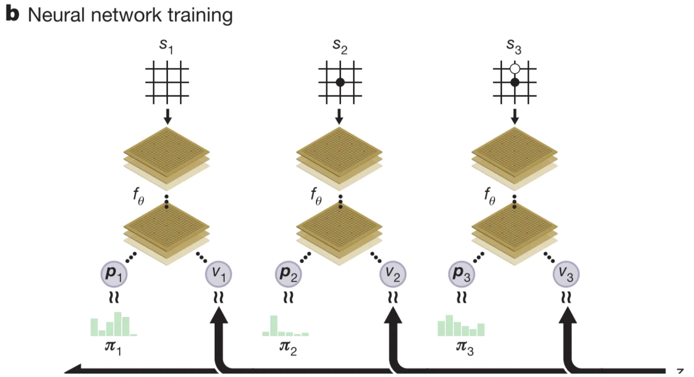

# Introduction

## AlphaGo

AlphaGo was the first AI to beat top human Go players. AlphaGo combines **CNN** with **MCTS** to play Go at a superhuman level.

It first trains two types of networks (**policy network** & **value network & rollout policy**), using the current game board combined with several handcrafted Go features  as **input**:

Then integrates the networks into MCTS to enhance the basic tree search.

**AlphaGo Zero** removes all human input.

- It learns **only** from self-play and starts from random play.
- Its input is **just the raw board** (white_stones), with no handcrafted features.
- It uses **one unified neural network** that outputs both policy and value.
- Its search is simpler (no rollouts) and relies entirely on the neural network.

# Method

## AlphaGo Zero

### Network

The network takes the raw board state and outputs:

- **p**: a distribution over moves
- **v**: probability of winning

It is made from deep residual blocks with **batch norm** and **ReLU**.

### Training the Network

In each training position, MCTS is run using the current network. 

MCTS produces an improved move distribution **π** through simulation like AlphaGo.

MCTS can therefore be viewed as a **policy improvement operator**. A new move is selected from π, and the self-play game continues.

After each game, the terminal result gives a final value **z**.

Training uses three terms to update the network:

- (z − v)² → match value prediction to the outcome
- −πᵀ log p → match network policy to the MCTS policy
- L2 regularization

### **Continuous Self-Improvement**

AlphaGo Zero repeatedly plays self-play games, updates the network, and replaces the old version when the new model wins enough evaluation games.

Over many iterations, the system improves rapidly and surpasses earlier AlphaGo versions.

# Novelty

1. It’s trained solely by self-play RL, starting from ran­dom play, without any supervision or use of human data. 
2. It uses only the black and white stones from the board as **input** features.
3. It uses a **single** **neural network**, rather than separate policy and value networks. 
4. It uses a **simpler tree search** that relies upon this **single neural network** to evaluate positions and sample moves.