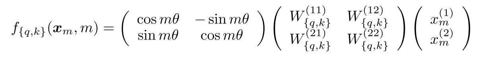
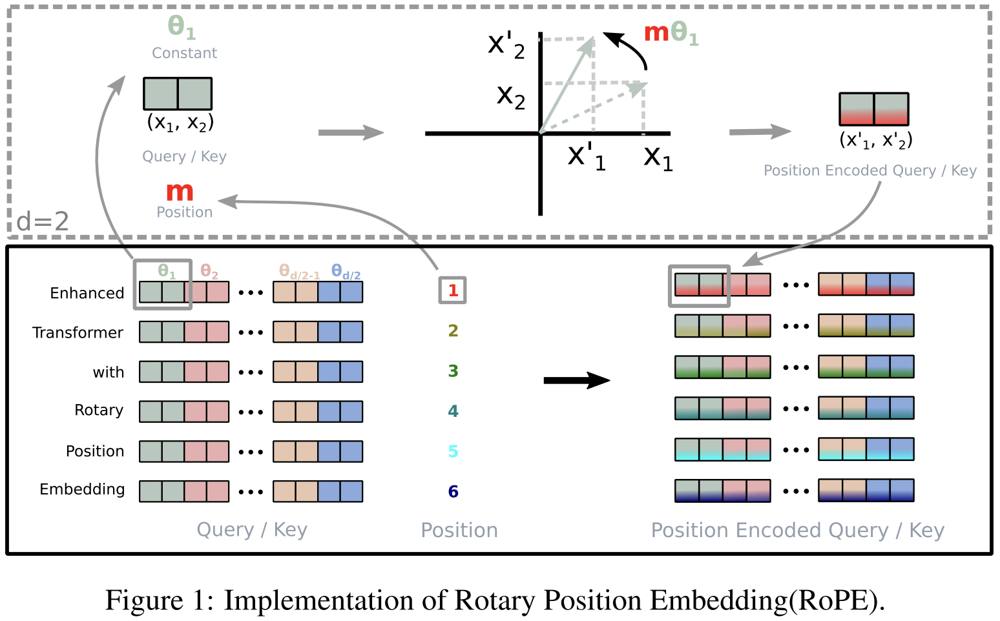
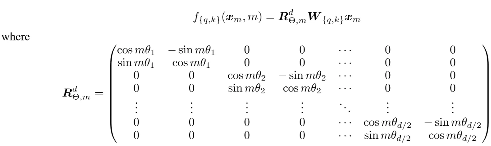
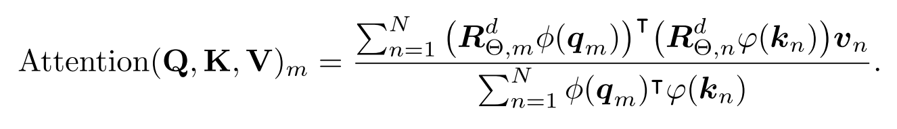

# Introduction

- Positional information is very important. Transformers need positional information;
- Old methods add it directly to token representations, making them incompatible with **linear self-attention**.

Motivation for **RoPE**:

- Self-attention is often seen as **position-agnostic**, which is undesirable.
    - Attention mechanism cannot understand word order by itself. It does not know the position of tokens.
- Need a method that:
    - Encodes both **absolute** and **relative** positions
    - Works with **linear self-attention**
    - Has good behavior for **long-range dependency modeling**

**→** Previous methods fail at least one of these.

# Method

### **Goal: Encode relative position inside attention**

Transformers use **self-attention**, which computes:

$$
q_m^\top k_n
$$

Right now, this inner product **does not include position information unless we manually add it**. 

The authors want:

$$
\langle f_q(x_m, m),\ f_k(x_n, n)\rangle = g(x_m, x_n, m - n)
$$

Meaning: **the attention score should depend on the relative position (m − n), not the absolute positions m and n**.

## **Rotary Position Embedding (RoPE)**

### **RoPE in 2D**

**Query encoding:**

$$
f_q(x_m, m) = (W_q x_m)e^{im\theta}
$$

**Key encoding:**

$$
f_k(x_n, n) = (W_k x_n)e^{in\theta}
$$

Here, multiplying by $e^{i m\theta}$ rotates the vector by an angle proportional to position m.

**Attention after rotation:**

$$
g(x_m, x_n, m-n)
= \text{Re}\left[ (W_q x_m)(W_k x_n)^* e^{i(m-n)\theta} \right]
$$

**Key idea:** Rotation angles subtract → giving **relative position** (m - n).

### **Real 2D rotation matrix form**

Complex rotation can be written as a real 2×2 matrix:

**Meaning:** A simple 2D rotation based on position index (m).

### **General RoPE for d-dimensional vectors**

Split $x\in R^d$ into **d/2 pairs**. For each pair, apply a 2D rotation with its own frequency $\theta_i$:

Frequencies:

$$
\theta_i = 10000^{-2(i-1)/d}
$$

(same spectrum as sinusoidal PE)

### **Relative position emerges in attention**

Applying RoPE inside attention:

$$
q_m^\top k_n
= x_m^\top W_q^\top R^d_{\Theta, n-m} W_k x_n
$$

Where:

$$
R^d_{\Theta, n-m} = (R^d_{\Theta,m})^\top R^d_{\Theta,n}
$$

**Meaning:** The effective rotation depends only on **relative distance** (n - m).

## RePE with linear attention

# Novelty

- Encode position by **rotation**, not by adding vectors.
- **Relative position** appears automatically through angle differences.
- **Compatible with linear attention** (unlike additive methods).
- **No extra parameters**; simple and stable.