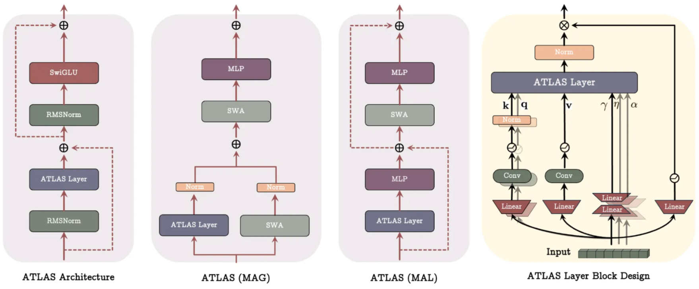

<aside>

Titans = learn to memorize token at test time,

**ATLAS** = learn to memorize context at test time, with more capacity, better objectives, and stronger optimizers.

</aside>

# **1. Introduction**

ATLAS addresses a fundamental limitation of modern recurrent memory models (e.g., Titans): they update memory **token by token**, using only the current key–value pair, which limits:

1. **Memory capacity** – only O(d) independent pairs can be stored.
2. **Memory quality** – memory captures individual tokens rather than the structure of a context span.
3. **Memory optimization** – update rules (e.g., gradient descent + momentum) are simple and often sub-optimal.
4. **Scalability** – sequential updates reduce parallelization.

To overcome these issues, ATLAS proposes a more expressive and scalable framework in which:

- Memory is a **deep MLP** updated during inference (like Titans),
- but the update rule optimizes memory **w.r.t. a whole context window**,
- using **richer feature mappings** and a **stronger internal optimizer**.

This allows the model to memorize **context**, not just individual tokens, while retaining RNN-style linear complexity.

# **2. Method**

The ATLAS framework has three core components:

## **2.1. High-capacity memory via polynomial feature mapping**

Instead of using raw keys $k$, ATLAS applies a **feature map** $\phi(k)$:

- Polynomial kernels increase effective dimensionality from $d → O(d^p)$.
- Exponential kernels approximate the exponential $q^T k$ of Transformers.

This dramatically increases memory capacity without increasing the number of memory parameters.

## **2.2. Context-aware memory update (Omega Rule)**

Unlike Titans (which update with only $(k_t, v_t)$),

ATLAS updates memory using a **sliding window of the last c tokens**:

$$
M_t = \arg\min_M \sum_{i=t-c+1}^{t} Y_i^{(t)} | M(\phi(k_i)) - v_i |^2
$$

Features:

- **Multi-token optimization**: memory learns from a context span, not a single token.
- **Learned gates $Y_i^t$**: controls how much each token contributes.
- **Generalizes classical rules**:
    - $c=1$ → Delta rule / Titans
    - $c=\infty$ → global optimization like attention

<aside>

This is the heart of ATLAS: memory performs **small-batch gradient descent at test time** on a local context.

</aside>

## **2.3. Stronger internal optimizer (Muon)**

ATLAS replaces Titans’ **first-order memory update** (gradient descent + momentum):

$$
M_t = \alpha_t M_{t-1} + S_t,\qquad
$$

$$
S_t = \gamma_t S_{t-1} - \eta_t \nabla \ell(M_{t-1}; k_t, v_t)
$$

with a **second-order, quasi-Newton style update** using the **Muon optimizer**.

Muon approximates the Newton update:

$$
M_t = M_{t-1} - H_t^{-1} \nabla \ell_t,
$$

and replaces $H_t^{-1}$ with a cheap matrix-free approximation using the **Newton–Schulz iteration**:

$$
H_t^{-1} \approx \text{NS}(G_t),
$$

where $G_t$ is an approximate curvature / preconditioner matrix.

Thus, the **ATLAS memory update using Muon** becomes:

$$
M_t
= \alpha_t M_{t-1} - \eta_t  \text{NS}(G_t) , \left( \sum_{i=t-c+1}^{t} Y_i^{(t)}
\nabla \ell(M_{t-1}; k_i, v_i) \right),
$$

where:

- $\alpha_t$ = learned forget gate
- $\eta_t$ = learned step size
- $Y_i^{(t)}$ = per-token contribution gate
- $\text{NS}(G_t)$ = **Muon** second-order curvature approximation

<aside>

ATLAS still computes the same gradient (the gap between predicted value and true value). Muon simply **reshapes** this gradient using an approximate second-order update, so the memory moves in a **smarter direction**, not just the steepest direction.

</aside>

## **Training & parallelization**

To make Omega Rule scale to long sequences, ATLAS:

- splits the sequence into **parallel chunks**,
- applies recurrent updates within a chunk,
- and applies parallelizable gradient accumulation across chunks.

Thus ATLAS preserves the GPU/TPU-friendly nature of Titans while significantly improving memory quality.

# **3. Novelty**

- **Attention replacement with linear complexity**
    
    ATLAS Layer substitutes the Transformer attention block with a **read–write memory module** that enables long-context reasoning at **O(n)** cost.
    
- **Context-based memory updates**
    
    ATLAS replaces token-level updates (Titans) with the **Omega Rule**, optimizing memory over a window of past tokens rather than only the current one.
    
- **Deep neural memory with high capacity**
    
    The memory is a **deep MLP** whose parameters are updated at inference.
    
    Polynomial/exponential feature maps expand keys/queries and give **super-linear memory capacity**.
    
- **Second-order test-time learning**
    
    Memory updates use the **Muon optimizer**, a quasi-Newton method, providing more stable and expressive learning than Titan’s first-order gradient descent.