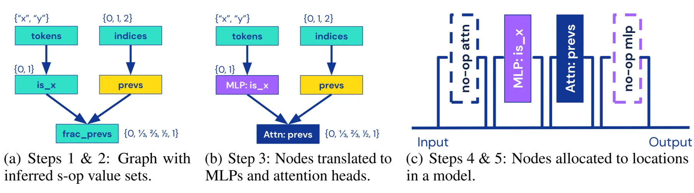

Laboratory for Interpretability

**Tracr** translates RASP programs to transformer weights in six steps:

1. **Split** the RASP program into small steps (a).
2. **Figure out** what each step can output (a).
3. **Label** each step as MLP or Attention (b).
4. **Arrange** them into Transformer layers (c).
5. **Insert** no-op blocks to fill empty spots (c).
6. **Generate** real Transformer weights that implement each step.

