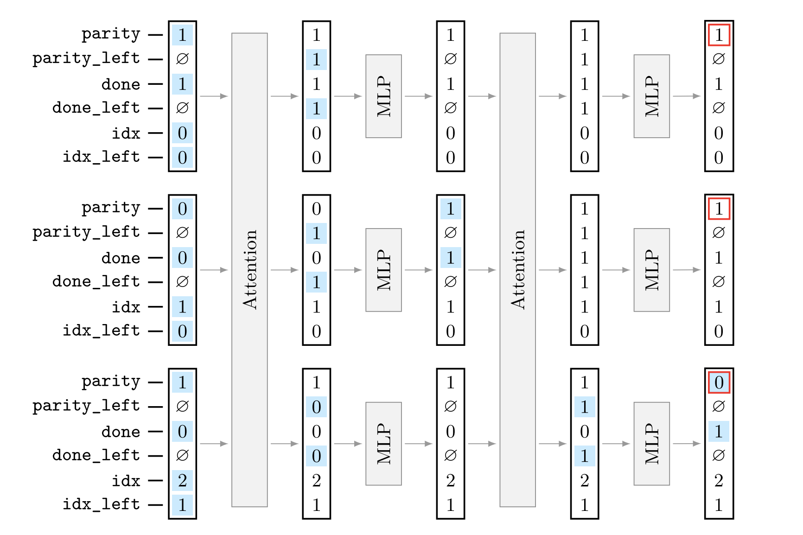
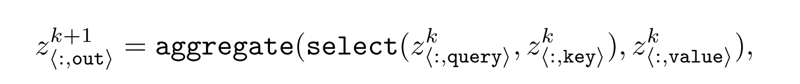

ALTA is a new programming language and a compiler that can map ALTA programs to Transformer weights. 

It can help clearly analyze what algorithms Transformers can represent, why sometimes fail to learn them, and how to design models that generalize compositionally.

# 1. Proposed Framework

## 1.1. Overview

<aside>

An ALTA program specification includes three key components: 

- a set of **variables**,
- a set of **attention heads**,
- a “**MLP** function”

To mirror Transformer computation.

</aside>

An ALTA Program Example - parity

A Transformer can implement this parity algorithm because:

1. **Residual stream = variables stored inside the hidden vector**
    
    (“store parity and done as part of the hidden state”)
    
2. **Attention = lookup from other tokens**
    
    (“give me the value from the previous token”)
    
3. **FFN/MLP = local computation**
    
    (“compute new parity from old parity”)
    

---

The ALTA framework includes:

- an interpreter
    - symbolically executes a program,
- a compiler
    - compiles programs to Transformer weights.

<aside>

**Symbolic representation:**

- an ALTA program: P
- input: a sequence of integers X
- output: a sequence of integers Y

---

Interpreter → func I: P x X → Y

Compiler → func C: θ = C(P)

---

**T(x, θ) ≈ I(P, x)**

- T: a transformer encoder
</aside>

## 1.2. Variables

There are **three kinds of variables** ALTA supports:

1. **Categorical variables**
    - Value is from a small finite set (e.g., `{0,1}`, `{A,B,C}`)
    - Represented as **one-hot vectors** inside the Transformer
2. **Numerical variables**
    - Real-number values
    - Represented as **a single neuron** (one scalar dimension)
3. **Set variables**
    - Values are sets of integers (e.g., `{1, 4, 7}`)
    - Represented as **multi-hot vectors**
4. Attention-head outputs as variables
    - Some variables come from attention heads
    - These can take a **null / undefined** value (e.g., when a head attends to no token)

One residual block

The residual stream is the single vector per token that all sublayers read and write.

## 1.3. **Execution**

<aside>

**Attention** affects inter-token variables:

- parity_left, done_left
- Any variable whose value comes from other tokens

**MLP** affects intra-token variables:

- parity, done
- Other algorithmic state variables
</aside>

---

ALTA represents each token’s state with symbolic variables, which correspond to segments of the Transformer’s residual vector.

<aside>

For layer k, token i:

z^k_{<i, idx>}
z^k_{<i, idx_left>}
z^k_{<i, parity>}
z^k_{<i, done>}
...

</aside>

**Initialization:** Input and position-dependent variables are encoded directly into the initial residual stream using embeddings.

<aside>

residual[i] = [ idx_onehot(0..2) | idx_left_onehot(0..2) | parity | done ]

</aside>

### **Per-layer execution**

**Self-attention:**

- `select(query, key)` builds a binary attention pattern based on variable equality.
- `aggregate` collects the corresponding `value` variables.
- This produces inter-token variables like `parity_left`.

**MLP:**

- Defined by symbolic **transition rules**.
- Compiler turns these into a fixed 4-layer ReLU network that updates variables (e.g., `parity`, `done`).

<aside>

Layer1 → ReLU → Layer2 → ReLU → Layer3 → ReLU → Layer4 → ReLU

- The first 2 layers are only responsible for converting numerical/set variables into **one-hot** bucket representations.;
- The final 2 layers are based on the set of **transition rules**.
</aside>

**Residual updates:** Attention and MLP outputs are added to the residual stream, as in standard Transformers.

**Halting & output:** Execution stops when a halting condition is met; the specified output variable is read from the final residual stream.

# 2. Expressibility and Learnability

### **2.1. Expressibility**

ALTA shows constructively that Transformers can exactly implement algorithms like parity, addition, and SCAN.

### **2.2. Learnability**

Even if an algorithm is expressible by a Transformer, **training** on input–output pairs may fail to learn it.

ALTA provides two tools to analyze and improve learnability:

1. **Trace supervision:** Use ALTA’s intermediate states as supervision to help training follow the intended algorithm.
2. **Minimality analysis:** A program must be **minimal** on the training set for the compiled Transformer weights to be a stable solution; non-minimal programs lead to unstable or incorrect learning.

# 3. **ALTA Summary**

Six sentences to summarize ALTA:

1. **ALTA is a formal programming language that describes the computation inside a transformer in a human-interpretable way.** It converts opaque neural operations into clear algorithmic steps.
2. **ALTA includes a compiler that translates an ALTA program into actual transformer weights** (embeddings, attention, FFN).
3. **ALTA programs use explicit symbolic variables** (e.g., idx, parity, done, parity_left) to track interpretable token-level states throughout the computation.
4. **Attention in ALTA implements inter-token communication**, enabling a token to read variables from other positions (e.g., computing left-side context like parity_left).
5. **FFNs implement intra-token updates**, modifying the variables of each token based only on its own state (e.g., updating parity or flags).
6. **Because attention moves information only one step per layer, n tokens often require O(n)(n-1) layers** for full information propagation.