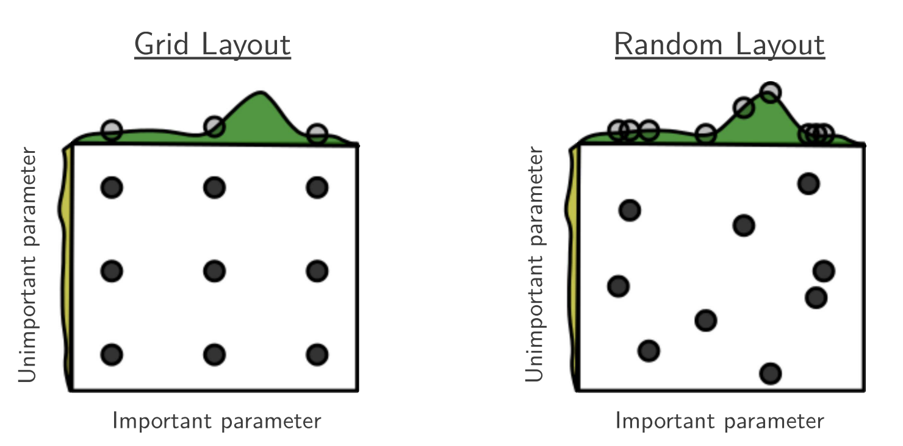

# ⁉ Why Is Hyperparameter Tuning So Difficult?

### Bengio’s Classic Paper Tells You: **Stop Using Grid Search!**

In machine learning, there’s a saying:

> “Training the model is easy. Tuning hyperparameters is hell.”
> 

Learning rate, number of layers, regularization strength, hidden units…

Everything seems important, but tuning them feels like opening blind boxes.

Today we look at a classic paper from Yoshua Bengio’s team:

**“Random Search for Hyper-Parameter Optimization.”**

Its key message is surprisingly simple:

> Random Search is far more efficient than Grid Search.
> 

It’s cheaper, faster, and works especially well in high-dimensional spaces.

Let’s walk through the core ideas of this paper in a beginner-friendly way.

# ❓1. Why Is Traditional Grid Search Inefficient?

The goal of hyperparameter optimization is simple:

> Find a set of hyperparameters λ that gives the best generalization performance.
> 

The usual routine:

- Try many λ combinations
- Train models
- Evaluate on validation data
- Pick the best

## But here’s the problem:

Grid Search does this:

- Pick several values for each hyperparameter
- Try **every combination**

As the number of hyperparameters grows, the number of combinations grows **exponentially**.

📌 The paper notes:

> Grid Search suffers badly from the curse of dimensionality.
> 

Even worse:

<aside>

❗ Most hyperparameters don’t matter very much..

</aside>

As shown later in the paper:

- For a given dataset, only 1–3 hyperparameters significantly affect performance
- Many others barely change anything
- But Grid Search still allocates equal effort across all dimensions

In simple words:

> Grid Search wastes massive compute exploring unimportant directions.
> 

# 🤓 2. Key Conclusion of the Paper: **Random Search Is Better**

The authors make a bold claim:

> Random Search is more efficient and often finds better models.
> 

And the reasoning is intuitive:

### 2.1. Random Search focuses more effectively on “important dimensions”

If only 1–2 hyperparameters matter:

- Grid Search: spreads effort unnecessarily across all dimensions
- Random Search: each sample covers all dimensions, increasing the chance of hitting useful values

The following figure illustrates:

- In a 2D function where only x matters,
- Grid Search tests only a few distinct x-values,
- Random Search can test many more unique x-values with the same budget.

### 2.2. Random samples are independent (i.i.d.)

This gives several engineering advantages:

- You can stop early
- You can add more trials anytime
- Trials naturally run in parallel, asynchronously
- Failed runs don’t affect anything

It’s simple, robust, and flexible.

# 🔬 3. Experiments Show: Random Search Finds Better Models Faster

The paper reproduces classic deep learning experiments on datasets like:

- MNIST variants
- rectangles
- convex
- plus experiments with DBNs involving 32 hyperparameters

## 🔥 The results are striking:

### ✔ With the same compute budget:

Random Search needs only:

- **8 trials to match Grid Search’s performance at 100 trials**
- **32 trials to outperform Grid Search**

### ✔ In high-dimensional DBN tuning:

Random Search performs:

- Better on 1 dataset
- Comparable on 4 datasets
- Slightly worse on 3 datasets

In short:

> Random Search is cheaper, faster, and still high-quality.
> 

# 🧠 4. A Hidden Highlight:

## How to Fairly Evaluate the “Best Model” from Hyperparameter Tuning?

Because the validation set is finite:

> The hyperparameter with the best validation score might not truly be the best.
> 
> 
> It may just have been “lucky” on this particular validation split.
> 

The paper proposes:

### ✔ Don’t report the test performance of only the single best λ.

Instead:

### ✔ Report a weighted average of test performances across all λ candidates.

The weight comes from:

- The probability that each λ would be the winner
    
    (considering validation noise and variance)
    

This gives a more **robust**, **unbiased**, and **fair** estimate of generalization.

# 📈 5. Why You Probably Should Stop Using Grid Search

The conclusion states clearly:

- Grid Search wastes computation
- Random Search is more efficient in high-dimensional spaces
- Random trials are easy to parallelize
- Random Search should be the standard baseline for evaluating new tuning algorithms

The implicit message:

> Unless you have only 1–2 hyperparameters, avoid Grid Search.
> 

# ⭐ 6. Practical Takeaways:

## Start Using Random Search for Hyperparameter Tuning!

**One-sentence summary of the paper:**

> Grid Search is inefficient; Random Search is faster and finds better results.
> 

**Why Random Search works better:**

1. Real models have low effective dimensionality.
2. Grid Search wastes effort in irrelevant dimensions.
3. Random Search offers wider, more meaningful exploration.
4. It’s parallel-friendly and simple to implement.

**A practical tip:**

> If you have more than 2 hyperparameters, Grid Search is almost always a bad idea.
> 

# 📌 7. Practical Advice for ML Engineers & Students

### ✔ Prefer Random Search over Grid Search

(even for neural networks and classical ML)

### ✔ If budget permits

Upgrade to **Bayesian Optimization**

### ✔ When tuning many hyperparameters (>20)

Use:

**Random Search + Early Stopping**

It often delivers surprisingly strong results.

# 🏁 Final Golden Sentence

> Random Search isn’t “trying things randomly”; it’s statistically one of the smartest ways to tune models.
>