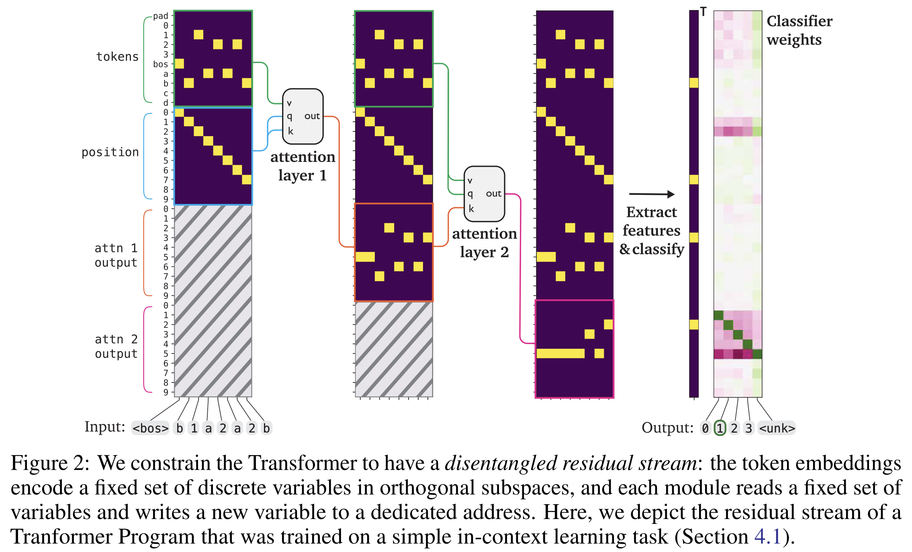
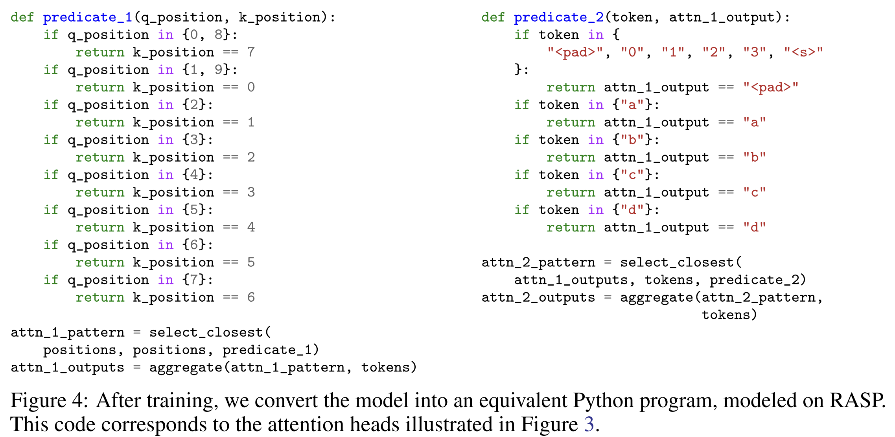

# Problem

Modern Transformers are powerful but **fundamentally opaque**. Even with mechanistic interpretability tools (attention analysis, circuit discovery), understanding *what algorithm a trained Transformer implements* still requires **heavy manual effort** and is often **incomplete or misleading**.

Previous work like **RASP** and **Tracr** shows that **human-written programs can be compiled into Transformers**, but **not the reverse**: we cannot take an arbitrary trained Transformer and reliably recover a faithful, human-readable program.

**Core problem:**

<aside>

Can we train Transformers so that their learned computation is, by construction, directly convertible into a discrete, interpretable program—without post-hoc reverse engineering?

</aside>

This paper targets **intrinsic interpretability**, not explanation after the fact.

## Method

The authors propose **Transformer Programs**:

<aside>

a restricted Transformer architecture that is trained with gradients but constrained so it can be deterministically decompiled into a RASP-style program.

</aside>

The method has three key ideas:

### 1. Disentangled Residual Stream (Program Variables)

- The residual stream is split into **named, orthogonal variables** (e.g. `tokens`, `positions`, `attn_1_output`, …).
- Each attention head **reads specific variables** (V) and **writes a new variable** to a fresh slot.
- This mirrors **RASP’s shared tape**, but implemented as structured residual slots.

### 2. Interpretable Attention = `select + aggregate`

- Each attention head is constrained to implement:
    - a **discrete predicate** (`which query attends to which key`)
    - followed by **hard attention** (attend to exactly one key).
- Attention predicates are parameterized as **categorical choices**, learned with **Gumbel-Softmax**, then discretized.
- This makes every head equivalent to a **RASP `select` operator**, with aggregation matching `aggregate`.

### 3. Discrete Optimization → Program Extraction

Training is done with **continuous relaxations** of discrete choices. After training, the model is **fully discretized**:

- predicates become `if/else` rules,
- attention becomes symbolic selection,
- MLPs become **lookup tables**.

The entire model is then **automatically converted into Python code**, functionally identical to the Transformer and debuggable with standard tools.

### Extensions

- **Numerical attention** for counting (RASP `selector_width`)
- **Constrained MLPs** as finite lookup tables
- Learned word embeddings decomposed into categorical variables

### One-sentence takeaway

Instead of explaining black-box Transformers, this paper trains Transformers that can be directly converted into programs, so interpretation becomes reading code—not guessing behavior.