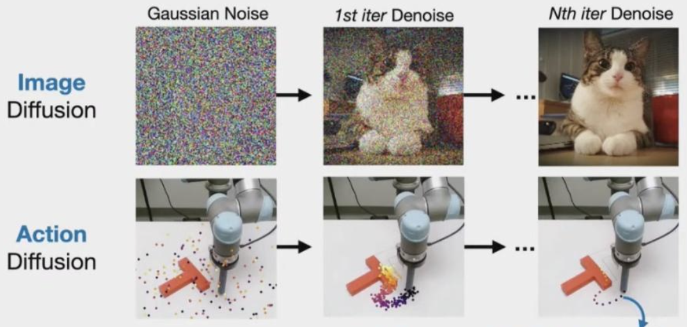
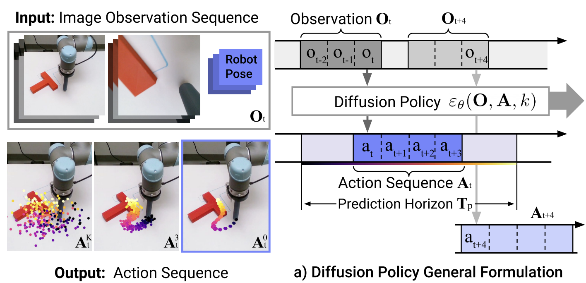
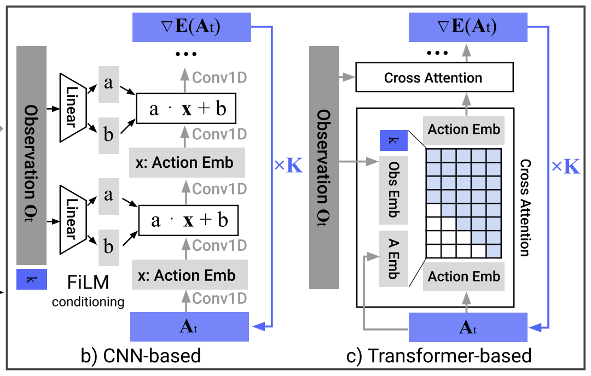
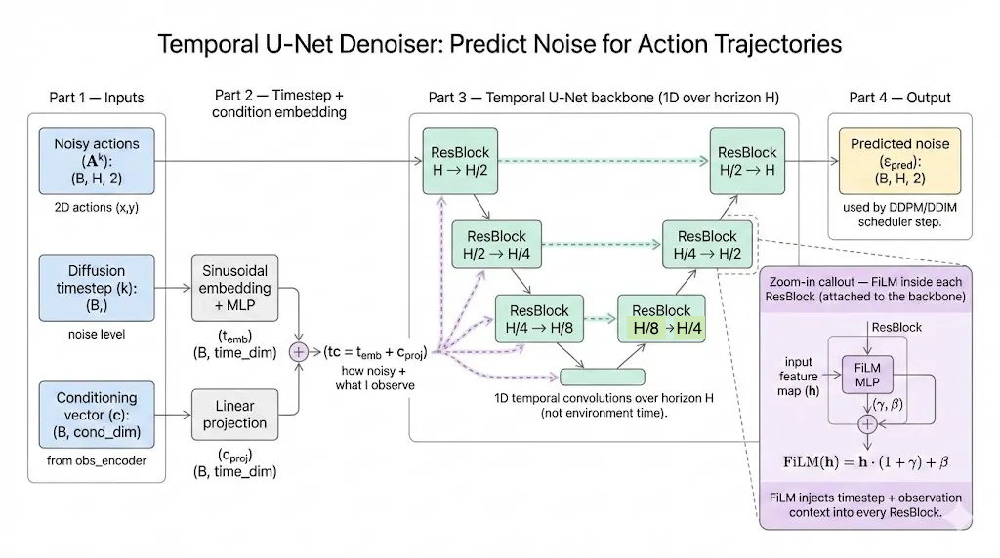

At the end of 2025, I spent a few days reproducing Diffusion Policy from [Diffusion Policy: Visuomotor Policy Learning via Action Diffusion](https://arxiv.org/abs/2303.04137).

I first spent about one day to go through the paper. If you are interested, feel free to check [paper reading note](https://my-blog-alpha-vert.vercel.app/notes/diffusion_policy_visuomotor_policy_learning_via_ac/). The work is impressive, so I decided to reproduce it over the Christmas break. This is the repo address https://github.com/mrtanke/diffusion-policy.

# Repo skeleton

```json
diffusion-policy/
├── diffusion_policy/                 # Library code (importable package)
│   ├── __init__.py                   # Package marker
│   ├── checkpoint.py                 # Save/load checkpoints
│   ├── normalizer.py                 # Min-max normalization to/from [-1, 1]
│   ├── data/
│   │   ├── pusht_zarr_dataset.py     # Load PushT replay data and return training samples: observation history + future action trajectory
│   │   └── sequence_utils.py         # Builds the start/end indices for each fixed-length training sample/window within episode
│   └── models/
│       ├── diffusion.py              # DiffusionPolicy training and sampling wrapper
│       ├── denoisers.py              # Temporal UNet denoiser / noise predictor
│       └── encoders.py               # Observation encoder
├── train.py                          # Main training entrypoint
├── eval_pusht.py                     # Eval script for PushT
└── data/pusht/                       # Local dataset folder (pusht_cchi_v7_replay.zarr/)
```

# Core algorithm

We want to generate an expert action trajectory by **denoising** a noise action trajectory, just like what Image diffusion do. To do this, we train a model to **predicted the noise** contained in each action from a noise action tractory. Then we use the predicted noise to gradually denoise the noise action trajectory. 



## Training

During training, we start from a clean expert action sequence $A^0$ and sample a diffusion step $k$. We add Gaussian noise $\varepsilon$ to it. In parallel, we encode the observation history(images and agent positions) into a conditioning representation $c$, and embed the diffusion step $k$ into a time embedding. The denoiser network takes $(c, A^k, k)$ as input and predict the injected noise $\hat{\varepsilon}$. 

We trained this conditional model by minimizing the MSE between $\hat{\varepsilon}$ and $\varepsilon$:

$$
\mathcal{L} = E_{k \sim p(k),\varepsilon}\left[|\varepsilon_\theta(A^k, k, c) - \varepsilon|^2\right]
$$

## Inference



We start from Gaussian noise trajectory, and iteratively denoise it for $K$ diffusion steps. At each iteration $k$, the denoiser predicts the noise $\varepsilon_\theta(c, A^k, k)$, and the DDPM scheduler applies a reverse-diffusion update to produce a slightly cleaner trajectory $A^{k-1}$.

The high-level function call is:

$$
A^{k-1}=DDPM(\varepsilon_\theta(O, A^k, k), k, A^k)
$$

Concretely, the DDPM update can be written as:

$$
A^{k-1}=\alpha\Big(A^k-\gamma \varepsilon_\theta(O, A^k, k)+\mathcal N(0,\sigma^2 I)\Big)
$$

Finally, we execute actions in **receding-horizon** mode, we typically **execute only the first** $n$ actions from $A^{0}$ (often $n≪T$), then observe the new state(new image + new agent position), re-encode observation $c$, and denoise a new action horizon.

# Dataset

<aside>

Goal: turn a replay buffer into many supervised training samples, so we can get the batch samples for training.

</aside>

The zarr replay buffer stores full episodes as a long sequence. However, Diffusion Policy doesn’t train on entire episode directly, it learns from many **short windows/samples**, each consisting of a short **observation history** (To steps) and a **future action horizon** (H steps).

So we design the core job of dataset class to be like: 

> “Given an index → map the index to one row of indices (buffer start, buffer end, sample start, sample end) → use these indices to slide data → pad if goes outside the episode → normalize and return tensors.”
> 

We want one dataset sample contains a stacked observation history (images + agent positions) and the corresponding expert action sequence. (The dimension `2` corresponds to agent position **x** and **y**):

- `obs_image`: `(To, 3, 96, 96)` in `[0, 1]`
- `obs_agent_pos`: `(To, 2)` normalized to `[-1, 1]`
- `action`: `(H, 2)` normalized to `[-1, 1]`

The default window configuration is:

- `To = 2` number of observation steps used for input (conditioning)
- `H = 10` number of actions in the predicted action horizon
- `Ta = 8` number of actions actually executed before replanning

We call this **receding-horizon** control because the policy always generates a full horizon of $H$ actions, but only executes the first $Ta$ actions, then observes the new state(observation history) and replans a new horizon(actions). This makes control more robust, since the plan is constantly updated using the latest observations.

## Concrete Implementation


### 1. Build a window index table

The zarr replay buffer stores **multiple episodes concatenated** into one long array. Episode boundaries are provided by `episode_ends` (end-exclusive indices). 

To make PyTorch-style random access possible, we precomputes a **table of sample indices once** which fully describes how to construct the sample. Each row corresponds to **one fixed-length horizon window** (length $H$) and contains four numbers:

- `buffer_start, buffer_end`: the **valid slice** inside the replay buffer (clipped to stay within a single episode)
- `sample_start, sample_end`: where that valid slice should be **placed** inside a fixed-length output window (the remaining positions are filled by padding)

### 2. Slice a horizon window

When `__getitem__(idx)` is called, we first reads one row from the precomputed index table with index `idx`: `(buffer_start, buffer_end, sample_start, sample_end)`. Then we slices the replay buffer using `buffer_start:buffer_end` and creates a length $H$ window and pads by repeating boundary elements.

This produces a fixed-length horizon window of length $H$, which can be used to constitute all data (actions, agent positions, and images).

### 3. Split observation and action

Although we constructs a padded sequence of length $H$, we uses only the first `To` steps as the observation history:

- `obs_image`: first `To` frames from the padded image sequence
- `obs_agent_pos`: first `To` steps from the padded agent position sequence
- `action`: the **full** length $H$ action sequence

So we aligns the data like this:

- condition on a short history (`To=2`)
- predict a full future horizon (`H=10`)

### 4. Normalize and return

We normalize so the model sees inputs and targets on a consistent, well-behaved scale, which makes training much easier and more stable.

For the image, the raw pixels are often `0–255`. Scaling to `[0,1]` keeps values small and standard for CNNs. The positions and actions can have arbitrary units and ranges. Mapping them to `[-1,1]` prevents one dimension from dominating gradients and makes the diffusion noise scale “match” the data scale.

Finally, one dataset sample returns:

```python
{
  "obs_image":      (To, 3, 96, 96),
  "obs_agent_pos":  (To, 2),
  "action":         (H, 2),
}
```

## DataLoader

The code snippet of dataloader is as follows:

```python
dl = DataLoader(ds, batch_size=B, shuffle=True, ...)
batch = next(iter(dl))
```

The dataloader first samples **B indices** (random if `shuffle=True`), then calls `ds[i]` for each *i*, finally stack them into a batch and return.

So the batch becomes:

```python
{
  "obs_image":      (B, To, 3, 96, 96),
  "obs_agent_pos":  (B, To, 2),
  "action":         (B, H, 2),
}
```

Now we get the batch data for model training…

# Model Overview

The Diffusion Policy paper describes two pratical denoiser families, CNN-based and Transformer-based temporal denoisers. **CNN-based temporal denoisers** are simple, trains more reliably, and usually less sensitive to hyperparameters choices. **Transformer denoisers** can be more expressive, but training and performance can be more sensitive to design choices (depth, attention layout, normalization, learning rate, etc.).



In the first stage of reproduction, we just implement CNN-based Temporal UNet. The goal is to get a good Diffusion Policy implementation that trains reliably and reaches decent performance.

## Denoiser



The denoiser’s job is straightforward: given a noisy action trajectory, the diffusion timestep $k$, and the conditioning observations, it predicts the noise that was added. 

We use a **Temporal U-Net** as the diffusion denoiser. It predicts the noise ε added to an expert action trajectory by accepting three types of input:

- Noisy action $A^k$: `(B, H, 2)`
- Diffusion timestep $k$: `(B,)`
- Conditioning vector $c$ (from the observation encoder): `(B, cond_dim)`

We first embed the diffusion step $k$ using a **sinusoidal positional embedding** (Transformer-style), then project the conditioning vector $c$ to the same dimension and add them together. This produces a single conditioning vector used throughout the network.

### FiLM

To inject the conditioning vector into the U-Net, each residual block uses **FiLM** conditioning: from the combined conditioning vector we generate a scale–shift pair $(\gamma, \beta)$ and modulate the feature map $h$ as:

$$
\text{FiLM}(h) = h \cdot (1+\gamma) + \beta
$$

In the downsampling path, at each stage, the feature map is passed through a FiLM-conditioned residual block, so the block output is $h+f(h, cond)$, and it is downsampled by a strided 1D convolution that halves the temporal length except at the last level.

In the upsampling path, the feature map is first upsampled by a transposed 1D convolution that doubles the temporal length, then it is combined with the corresponding skip feature (added), and finally passed through another FiLM-conditioned residual block with the same residual form $h+f(h, cond)$. This lets the model denoise the same noisy actions differently under different observations. The final output is the predicted noise $ε_{pred}$ with shape (B, H, 2).

# Diffusion Policy

So far we introduced the denoiser architecture (Temporal U-Net + FiLM). Next, we wrap it into a **Diffusion Policy**. This module combines an **observation encoder** and a **diffusion denoiser** into a single policy module, and uses a DDPM scheduler to handle the forward noising process (training) and reverse denoising process (inference). 

- **Observation encoder**: compress the observation history (images + agent positions) into a conditioning vector $c$.
- **Diffusion denoiser**: sample a diffusion timestep $k$ (one per batch element), add Gaussian noise to the expert action horizon to form a noisy trajectory $A^{k}$, then use $(A^{k}, k, c)$ to predict the added noise $ε_{\text{pred}}$.

Below, we introduce the policy in two parts: training and inference. Actually, there are two functions for different process to call:

- `forward(batch)`: returns **loss**
- `sample_actions(obs)`: returns **(B, H, 2)** action trajectory

## Training: learn to predict the added noise

During training, the policy takes a batch from the dataset, and returns a single scalar loss. For each batch,

1. **Encode observations once**
    
    We first compute the conditioning vector. This same conditioning is reused across the whole diffusion step for that sample.
    
```python
    c = obs_encoder(obs_image, obs_agent_pos)
```
    
2. **Sample a diffusion timestep**
    
    For each batch element, we randomly sample a timestep $k$ (uniformly over all diffusion steps). This forces the model to learn how to denoise trajectories at **all noise levels**, not just one.
    
3. **Add noise to expert actions**
    
    Starting from the clean expert action horizon $A^0$ (the dataset action sequence), we inject Gaussian noise to obtain a noisy trajectory $A^k$.
    
4. **Predict noise and compute loss**
    
    The denoiser predicts the added noise $\varepsilon_{\text{pred}}=\varepsilon_\theta(A^k, k, c)$. We train it with an MSE loss against the true injected noise $\varepsilon$:
    
    $$
    \mathcal{L} = |\varepsilon_{\text{pred}} - \varepsilon|_2^2
    $$
    
This teaches the model to remove noise and recover the expert-like action trajectory conditioned on the observation.
    

## Inference: generate an action horizon

At test time, we don’t have expert actions. We start from pure Gaussian noise and iteratively denoise:

1. **Encode observations once** to get $c$.
2. **Initialize** a random action trajectory $A^K \sim \mathcal{N}(0, I)$.
3. **Iterate over diffusion timesteps**, for each iteration, we predict noise $\varepsilon_\theta(A^k, k, c)$, then use the diffusion scheduler update rule to produce a slightly cleaner trajectory $A^{k-1}$.
4. After the final step, we obtain $A^0$, a denoised action horizon, and clamp it to the training range [-1,1].

In downstream control, we typically execute only the first $T_a$ actions (receding horizon), then re-observe and replan (re-inference).

## DDPM Schduler

I think I can’t skip the introduction of DDPM schduler (`DDPMScheduler`). Even though my main focus is the vla model design and logic, the scheduler is impressive and worth noting.

The code snippet that initializes DDPMScheduler is as follows, we’ll give a short introduction later.

```python
self.noise_scheduler = DDPMScheduler(
    num_train_timesteps=cfg.num_train_timesteps,
    beta_schedule=cfg.beta_schedule,
    prediction_type=cfg.prediction_type,
    clip_sample=False,
)
```

In this implementation, `DDPMScheduler` is in charge of the **diffusion mechanics,** it defines how we **add noise** during training and how we **remove noise** during inference.

### Training: add noise to expert actions

Given clean expert actions $A^0$, we sample a diffusion timestep $k\in{0,\dots,K-1}$ and generate a noisy trajectory $A^k$.

The DDPM forward noising process can be written as:

$$
A^k = \sqrt{\bar{\alpha}_k},A^0 + \sqrt{1-\bar{\alpha}_k},\varepsilon,\quad \varepsilon\sim\mathcal{N}(0,I)
$$

Here $\bar{\alpha}_k$ is determined by the scheduler’s noise schedule (controlled by `beta_schedule` and `num_train_timesteps`. Intuitively, small $k$ holds little noise and large $k$ represents heavily collapse, close to pure Gaussian.

In code, we call `add_noise(action, noise, k)` to produce `x_noisy`. The scheduler provides a consistent definition of what “noise level (k)” means.

### Inference: iteratively denoise

Start from pure noise $A^K \sim \mathcal{N}(0,I)$, we denoise step-by-step from large $k$ to small $k$. At each step, the denoiser predicts noise $\varepsilon_{\text{pred}}=\varepsilon_\theta(A^k, k, c)$, then the scheduler uses this prediction to compute a slightly cleaner sample $A^{k-1}$ via the DDPM update rule (plus optional stochasticity). The mathmatical formal of scheduler processing is like:

$$
A_t^{k-1} = \alpha \left( A_t^k - \gamma \, \varepsilon_\theta(O_t, A_t^k, k) + \mathcal{N}(0, \sigma^2 I) \right)
$$

# Scripts

## train.py

`train.py` is the end-to-end training entry point for the repo. It loads the PushT zarr replay as fixed-length windows (`To=2`, `H=10`), builds the DiffusionPolicy), and trains it with an AdamW optimizer using `accelerate` for device and mixed-precision support and optional gradient accumulation. 

During training it maintains an EMA copy of the model for more stable evaluation, prints loss periodically, and saves checkpoints, so training can be resumed or evaluated later.

## eval_pusht.py

`eval_pusht.py` runs a trained Diffusion Policy checkpoint in the `pusht-v0` Gymnasium environment and reports rollout returns. It rebuilds the same model architecture as training, loads the checkpoint (preferring EMA weights if available) and the saved normalizer.
Then it repeats: maintains a `To=2` observation history, samples a length `H=10` action trajectory with executing a chosen number of diffusion inference steps, unnormalizes actions back to the environment scale, and executes the first `Ta=8` actions in a receding-horizon loop until the episode ends.

# Over

This is basiclly the full story of this reproduction. Recently I’ve been diving into the work of embodied intelligence, so I really enjoyed the whole process and excited to move on to the next VLA project.

# References

1. Ajay, A., Du, Y., Gupta, A., et al. "Diffusion Policy: Visuomotor Policy Learning via Action Diffusion." arXiv:2303.04137, 2023.
2. reven. "Diffusion Policy: Visuomotor Policy Learning via Action Diffusion (Reading Notes)." [https://my-blog-alpha-vert.vercel.app/notes/diffusion_policy_visuomotor_policy_learning_via_ac/](https://my-blog-alpha-vert.vercel.app/notes/diffusion_policy_visuomotor_policy_learning_via_ac/), 2025.
3. Tassa, Y., Doron, Y., Muldal, A., et al. "DeepMind Control Suite." arXiv:1801.00690, 2018.
4. Ho, J., Jain, A., and Abbeel, P. "Denoising Diffusion Probabilistic Models." Advances in Neural Information Processing Systems (NeurIPS), 2020.
5. Vaswani, A., Shazeer, N., Parmar, N., et al. "Attention Is All You Need." Advances in Neural Information Processing Systems (NeurIPS), 2017.
6. Wolf, T., Debut, L., Sanh, V., et al. "Transformers: State-of-the-Art Natural Language Processing." Proceedings of the 2020 Conference on Empirical Methods in Natural Language Processing: System Demonstrations (EMNLP), 2020.
7. Ronneberger, O., Fischer, P., and Brox, T. "U-Net: Convolutional Networks for Biomedical Image Segmentation." In Medical Image Computing and Computer-Assisted Intervention (MICCAI), 2015.
8. Perez, E., Strub, F., de Vries, H., Dumoulin, V., and Courville, A. "FiLM: Visual Reasoning with a General Conditioning Layer." Proceedings of the AAAI Conference on Artificial Intelligence, 2018.